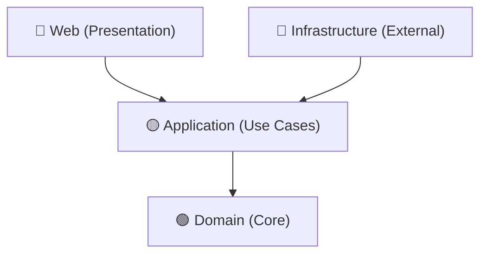

# 🏛️ TicketsPlease – Architectural Blueprint

Strikte architektonische Leitplanken und Patterns.

## 📋 Table of Contents

- [📐 Clean Architecture Layers](#-clean-architecture-layers)
- [⚡ CQRS \& MediatR Pipeline](#-cqrs--mediatr-pipeline)
- [🗄️ EF Core Resilience Strategy](#-ef-core-resilience-strategy)

---

## 📐 Clean Architecture Layers

Abhängigkeiten fließen **immer** in Richtung Domain.

- **Domain:** Rich Models, keine externen Abhängigkeiten.
- **Application:** Commands, Queries, Interfaces.
- **Infrastructure:** Persistence, External Services.
- **Web:** ViewModels, Views, Controllers.

---

## ⚡ CQRS & MediatR Pipeline

Jeder Command durchläuft eine vordefinierte Pipeline:

1. **LoggingBehavior:** Performance-Tracking & Tracing.
2. **ValidationBehavior:** FluentValidation-Check (Mandatory!).
3. **TransactionBehavior:** Unit of Work & Resilience.

---

## 🗄️ EF Core Resilience Strategy

- **Lesezugriffe:** Immer `.AsNoTracking()`.
- **Schreibzugriffe:** Explizite `RowVersion` (Optimistic Concurrency).
- **Resilience:** SQL Retry-Policy in `AppDbContext` aktiv.

---

_ArchBlueprint v1.0 | 2026-03-09_
