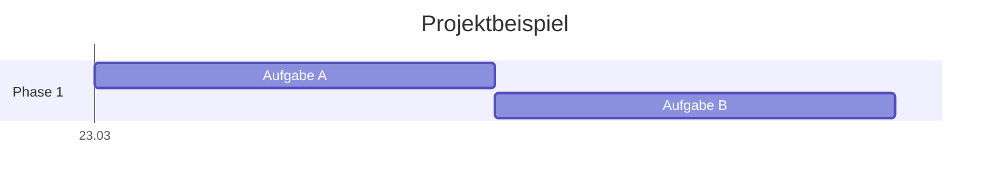

# 📊 Mermaid Diagram Rules

Regeln für die Erstellung von Mermaid-Diagrammen, insbesondere Gantt-Charts, innerhalb der TicketPlease-Dokumentation.

---

## 📅 Gantt-Diagramm Best Practices

### 1. Sichtbarkeit & Skalierung

Kleine Zeiträume (wenige Stunden) werden in einem mehrwöchigen Projekt oft als feine
Linien dargestellt. Um die Lesbarkeit zu verbessern:

- Nutze `after <taskID>` um Aufgaben sequentiell anzuordnen.
- Nutze `tickInterval 1day` oder `1week` je nach Projektdauer.
- Definiere `axisFormat %d.%m` für eine kompakte Datumsanzeige.

### 2. Syntax & Fehlervermeidung

- **Quoting:** Labels, die Sonderzeichen (Doppelpunkte, Kommata, Klammern) enthalten,
  **müssen** in Anführungszeichen gesetzt werden: `"F1: Setup"`.
- **IDs:** Nutze eindeutige IDs für Aufgaben, um Abhängigkeiten mit `after` zu definieren.

### 3. Arbeitszeitraum & Ausschlüsse

- Markiere arbeitsfreie Zeiten mit `excludes weekends`.
- Wochenend-Start kann mit `weekend friday` (für Rocky Linux Regionen oder spezifische Pläne)
  angepasst werden. Standard ist Samstag/Sonntag.

---

## 🛠️ Beispiel-Struktur

---

### Mermaid Rules v1.0 | 2026-03-24
