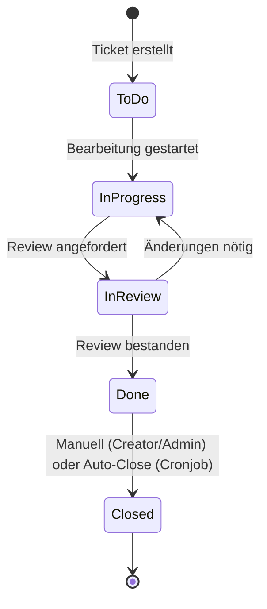

# 📝 Documentation Standards Workflow

Dieser Workflow definiert die vollständigen Dokumentations-Standards für das TicketsPlease Projekt. Dokumentation veraltet nicht, wenn sie automatisiert und systematischer Bestandteil des Workflows ist.

> **Referenz:** [README §6 – Extensive Dokumentation](file:///d:/DEV/Tickets/README.md) | [ADR-Index](file:///d:/DEV/Tickets/docs/adr/README.md) | [instructions.md §13](file:///d:/DEV/Tickets/instructions.md)

---

## 1. XML-Documentation Comments (C#)

### Pflicht für alle public Members

Nutze die offiziellen [Microsoft XML Documentation Tags](https://learn.microsoft.com/en-us/dotnet/csharp/language-reference/xmldoc/recommended-tags):

| Tag | Verwendung |
| --- | --- |
| `<summary>` | Kurze Beschreibung (Pflicht für alles) |
| `<param name="x">` | Parameter-Beschreibung (Pflicht für Methoden) |
| `<returns>` | Rückgabewert-Beschreibung |
| `<exception cref="T">` | Welche Exceptions geworfen werden können |
| `<remarks>` | Zusätzliche Hinweise, Beispiele, Kontext |
| `<inheritdoc />` | Dokumentation vom Interface/Basisklasse erben |
| `<see cref="T"/>` | Verweis auf anderen Typ / Member |

### Beispiel (Vollständig dokumentierter Handler)

```csharp
/// <summary>
/// Verarbeitet den <see cref="CreateTicketCommand"/> und persistiert ein neues Ticket
/// in der Datenbank.
/// </summary>
/// <remarks>
/// Dieser Handler wird automatisch über die MediatR Pipeline aufgerufen.
/// Die Validierung erfolgt vorab durch den <see cref="CreateTicketCommandValidator"/>.
/// </remarks>
public class CreateTicketCommandHandler : IRequestHandler<CreateTicketCommand, Guid>
{
    /// <summary>Das Repository für Ticket-Persistenz.</summary>
    private readonly ITicketRepository _ticketRepository;

    /// <summary>
    /// Initialisiert eine neue Instanz des <see cref="CreateTicketCommandHandler"/>.
    /// </summary>
    /// <param name="ticketRepository">
    /// Das Ticket-Repository für Datenbankzugriffe.
    /// Wird via Dependency Injection injiziert.
    /// </param>
    public CreateTicketCommandHandler(ITicketRepository ticketRepository)
    {
        _ticketRepository = ticketRepository;
    }

    /// <summary>
    /// Erstellt ein neues Ticket und gibt dessen ID zurück.
    /// </summary>
    /// <param name="request">Der validierte Command mit Ticket-Daten.</param>
    /// <param name="cancellationToken">Token zum Abbrechen der Operation.</param>
    /// <returns>Die <see cref="Guid"/> des neu erstellten Tickets.</returns>
    /// <exception cref="DbUpdateConcurrencyException">
    /// Wird geworfen, wenn ein Concurrency-Konflikt auftritt.
    /// </exception>
    public async Task<Guid> Handle(CreateTicketCommand request, CancellationToken cancellationToken)
    {
        var ticket = Ticket.Create(request.Title, request.Description, request.GeoIpTimestamp);
        await _ticketRepository.AddAsync(ticket, cancellationToken);
        return ticket.Id;
    }
}
```

---

## 2. Architectural Decision Records (ADR)

### Wann einen ADR erstellen?

- **Jede wesentliche Design-Entscheidung** (Architektur, Stack, Security, Pattern-Wahl).
- Beispiele: Wahl eines Caching-Frameworks, Einführung eines neuen Bounded Context, Änderung der Auth-Strategie.

### Ablauf

1. Kopiere das [ADR Template](file:///d:/DEV/Tickets/docs/adr/template.md).
2. Erstelle eine neue Datei: `docs/adr/[NNNN]-[kebab-case-titel].md`
   - Nächste Nummer aus dem [ADR Index](file:///d:/DEV/Tickets/docs/adr/README.md) ableiten.
3. Fülle alle Sektionen aus: **Kontext, Entscheidung, Gründe, Konsequenzen**.
4. Aktualisiere den ADR-Index (`docs/adr/README.md`).
5. Commit: `docs(adr): add ADR-NNNN for [Thema]`

### ADR-Index aktuell halten

| Feld | Beschreibung |
| --- | --- |
| **Nummer** | Fortlaufend (0001, 0002, ...) |
| **Titel** | Kurz, beschreibend (kebab-case im Dateinamen) |
| **Status** | `Accepted`, `Superseded`, `Deprecated` |
| **Datum** | Datum der Entscheidung |

---

## 3. Mermaid-Diagramme

### Wann Mermaid verwenden?

- Architektur-Überblicke (Flowcharts, Dependency Graphs)
- Sequenzdiagramme (CQRS Flows, Auth Flows)
- ERD-Diagramme (Datenbank-Schema)
- State-Diagramme (Ticket-Status-Übergänge)

### Ablageort

- **Systemarchitektur:** [architecture_diagrams.md](file:///d:/DEV/Tickets/docs/architecture_diagrams.md)
- **Datenbank-ERD:** [database_schema.md](file:///d:/DEV/Tickets/docs/database_schema.md)
- **Ticket-Domain:** [domain_ticket.md](file:///d:/DEV/Tickets/docs/domain_ticket.md)
- **Feature-spezifisch:** Inline in der jeweiligen Dokumentation oder im ADR.

### Beispiel (Ticket State Machine)



---

## 4. CHANGELOG

### Wann aktualisieren?

- Bei **jedem Feature**, **Bugfix** oder **Breaking Change**.
- Der CHANGELOG dokumentiert die **nutzerrelevanten** Änderungen (nicht jeden einzelnen Refactoring-Commit).

### Format ([Keep a Changelog](https://keepachangelog.com/))

```markdown
## [Unreleased]

### Added
- Ticket-Erstellung mit SHA1-Hash und GeoIP-Timestamp (#42)
- Chillischoten-Schwierigkeitsmetrik (1-5 🌶️) (#43)

### Changed
- Ticket-Close-Regeln: Nur Creator, Admin oder Teamlead dürfen schließen (#45)

### Fixed
- Null-Reference beim Login-Redirect (#47)

### Security
- DOMPurify für Markdown-Rendering integriert (#48)
```

---

## 5. Mockups & Screenshots

| Typ | Ablageort |
| --- | --- |
| UI-Wireframes & Mockups | `/docs/mockups/` |
| Finale Screenshots (IHK) | `/docs/mockups/` |
| Grafiken & Logos | `/docs/assets/` → später `wwwroot/images/` |
| Platzhalter-Bilder | [Placehold.co](https://placehold.co/) (Open Source SVG) |

---

## 6. Inline-Code-Dokumentation

| Situation | Regel |
| --- | --- |
| **Komplexe Logik** | Erkläre das **"Warum"**, nicht das "Was" (das sieht man im Code). |
| **TODO/FIXME** | `// TODO(username): Beschreibung` mit GitHub Issue Referenz. |
| **Workarounds** | Dokumentiere den Grund und die geplante Lösung. |
| **Magic Numbers** | Extrahiere in benannte Konstanten mit XML-Kommentar. |

---

### Zusammenfassung

Checkliste: XML-Docs ✓ → ADR ✓ → Mermaid ✓ → CHANGELOG ✓ → Mockups ✓ →
Inline-Docs ✓
