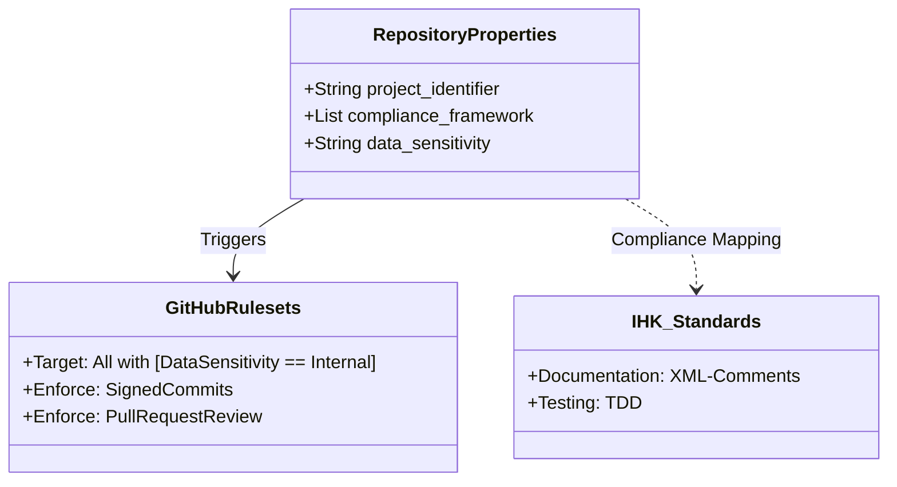

# Repository Custom Properties

> [!IMPORTANT]
> This file serves as the **Source of Truth** for the Custom Properties that must be configured in the GitHub Repository Settings at the Organization level.

## Overview

Custom properties allow us to categorize and govern the `TicketsPlease` repository using structured metadata. This data is used by GitHub for search, filtering, and automated ruleset enforcement.

## Configuration Table

| Property Name | Required | Type | Recommended Value | Description |
| :--- | :---: | :--- | :--- | :--- |
| `repository_type` | Yes | Single-select | `backend` | Core architectural role. |
| `production_state` | Yes | Single-select | `production` | Reliability/Maturity tier. |
| `data_sensitivity` | Yes | Single-select | `internal` | Data protection classification. |
| `ihk_compliance` | Yes | Boolean | `true` | Alignment with exam standards. |

## Automation Logic

The following diagram illustrates how these properties interact with GitHub's automation engine.

## How to update

1. Navigate to **Organization Settings** > **Repository** > **Custom Properties**.
2. Ensure the definitions match the table above.
3. Apply the values specifically to the `TicketsPlease` repository.
