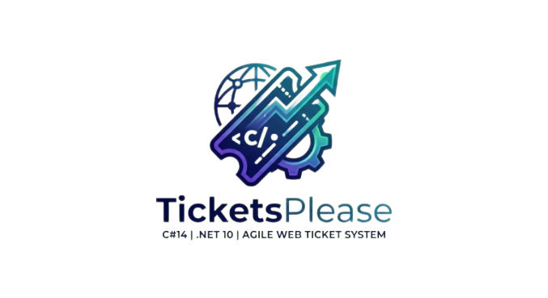
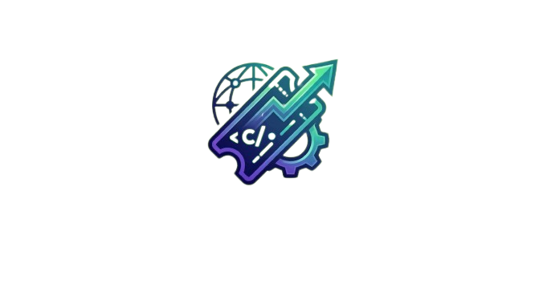

# 🎫 TicketsPlease – Enterprise Kanban & Collaboration Suite



## 📖 Einleitung

**TicketsPlease** ist ein hochmodernes, kollaboratives und skalierbares Kanban-Ticketsystem, entwickelt mit **C# 14, ASP.NET Core 10.3 und Entity Framework Core 10**. Es wurde als Referenzimplementierung für moderne Enterprise-Softwarearchitektur konzipiert und folgt strikt den Prinzipien von **Clean Architecture** und **Domain-Driven Design (DDD)**.

Das System bietet eine vollständige Lösung für das Aufgabenmanagement in Teams – von der Projektplanung über die Ticket-Bearbeitung bis hin zur Echtzeit-Kommunikation und SLA-Überwachung.

---

## 🚀 Key Features & MVP Scope

| Bereich | Feature | Beschreibung |
| :--- | :--- | :--- |
| **Board** | **Interaktives Kanban** | Visuelle Matrix (Todo, In Progress, Review, Done) mit Drag & Drop Support. |
| **Tickets** | **Lifecycle Management** | CRUD-Operationen, Zuweisungen, Priorisierung und Subtickets (Checklisten). |
| **Kollaboration** | **Messaging & Comments** | Echtzeit-Chat (SignalR), Kommentare mit Markdown & Anhängen. |
| **Governance** | **RBAC & Audit** | Rollenbasiertes Rechtesystem (Admin bis Stakeholder) und lückenlose Historie. |
| **Performance** | **SLA & Tracking** | Response- & Resolution-Deadlines sowie integrierte Zeiterfassung pro Ticket. |
| **Architektur** | **Plugin-Ready** | Entkoppelte Domänenlogik bereit für Enterprise-Erweiterungen. |

---

## 🛠️ Technologie-Stack

Das Projekt nutzt den aktuellsten Microsoft-Technologie-Stack (Stand 2026):

*   **Runtime:** .NET 10.3 LTS (C# 14)
*   **Web-Framework:** ASP.NET Core 10.3 MVC & Razor Pages
*   **Echtzeit:** Microsoft SignalR (WebSockets)
*   **Datenbank:** Microsoft SQL Server via Entity Framework Core 10 (Code-First)
*   **API-Infrastruktur:** Scalar OpenAPI v2 (BluePlanet Theme)
*   **Validation:** FluentValidation & CQRS Pattern (MediatR)
*   **Frontend:** Tailwind CSS 4.2.2 (MSBuild-integriert, Node-frei), SortableJS, FontAwesome 7.2
*   **Theming:** `ICorporateSkinProvider` für dynamisches CSS-Skinning (Azure/Sky Blue)

---

## ⚙️ Installation & Setup

### Voraussetzungen
Stellen Sie sicher, dass folgende Komponenten installiert sind:
1.  **[.NET 10 SDK](https://dotnet.microsoft.com/download/dotnet/10.0)** (v10.0.201+)
2.  **[Docker Desktop](https://www.docker.com/products/docker-desktop/)** (für SQL Server & Redis)
3.  **IDE:** Visual Studio 2026 (18.4+) oder JetBrains Rider 2026

### 1. Repository klonen
```bash
git clone https://github.com/T-Boyke/TicketsPlease.git
cd TicketsPlease
```

### 2. Infrastruktur starten (Docker)
Um den SQL Server zu starten, nutzen Sie das mitgelieferte Docker-Compose:
```bash
docker-compose up -d
```

### 3. Datenbank initialisieren (Migrations)
Führen Sie die Entity Framework Migrationen aus, um das Schema zu erstellen:
```bash
dotnet ef database update --project src/TicketsPlease.Infrastructure --startup-project src/TicketsPlease.Web
```

### 4. Assets & Build
Kompilieren Sie das Projekt, um Tailwind CSS zu generieren und NuGet-Pakete zu restoren:
```bash
dotnet build
```

---

## 🏃 Applikation starten

### Start via IDE
*   **Visual Studio:** Laden Sie die `TicketsPlease.slnx` und drücken Sie `F5`.
*   **Rider:** Nutzen Sie das Launch-Profil `TicketsPlease.Web: https`.

### Start via CLI
```bash
cd src/TicketsPlease.Web
dotnet run
```
Die Anwendung ist standardmäßig unter `https://localhost:7209` (oder dem konfigurierten Port) erreichbar.

### API Dokumentation
Die interaktive API-Dokumentation finden Sie unter:
`https://localhost:7209/scalar/v1`

---

## 🧪 Testing Strategie

Wir verfolgen einen "Zero-Compromise" Qualitätsansatz. Die Tests sind in den Ordner `/tests` gegliedert.

### Testarten im Projekt
*   **Unit Tests:** Validierung der Domain-Logik (xUnit & Moq).
*   **Integration Tests:** API- & DB-Tests via `WebApplicationFactory` und SQLite In-Memory.
*   **Architecture Tests:** Sicherstellung der Clean Architecture Regeln (NetArchTest.eXtend).
*   **Mutation Testing:** Härtung der Testsuites (Stryker.NET).
*   **E2E Tests:** Browser-Automation (Playwright).

### Tests ausführen
Um alle Tests in der Solution zu starten:
```bash
dotnet test
```

Um einen Mutation-Test-Report zu generieren:
```bash
dotnet stryker
```

---

## 🔍 Debugging & Diagnose

### IDE Werkzeuge
*   **Launch-Profile:** Konfigurierte `.vscode/launch.json` und Rider `runConfigurations` ermöglichen direktes Debugging von Controller-Logik und Background-Services.
*   **SQL Profiling:** Nutzen Sie den EF Core Log-Output im Debug-Fenster, um generierte SQL-Queries zu analysieren.

### Logging (Serilog)
Wir nutzen **Serilog** für strukturiertes Logging. Im `Development`-Mode werden Logs sowohl in der Konsole als auch in `/logs/log-.txt` ausgegeben.
*   **Einstellung:** In der `appsettings.Development.json` kann das Log-Level für spezifische Namespaces (z.B. `Microsoft.EntityFrameworkCore.Database.Command`) angepasst werden.

---

## 📖 Nutzung der Applikation

### Erste Schritte
1.  **Seeding:** Beim ersten Start im `Development`-Mode wird die Datenbank automatisch mit Testdaten (Bogus) befüllt (Admin, User, Projekte, Tickets).
2.  **Dashboard:** Das Haupt-Dashboard zeigt Statistiken und den persönlichen Status an.
3.  **Kanban Board:** Navigieren Sie zu "Board". Filtern Sie nach Projekten (F6) und ziehen Sie Tickets per Drag & Drop in neue Stadien.
4.  **Ticket-Checklisten:** Öffnen Sie ein Ticket, um Subtickets zu erstellen und abzuhaken.

### Rollenmodell (RBAC)
*   **Admin:** Globale Verwaltung, Workflows, Benutzer-Audit.
*   **ProductOwner/Teamlead:** Projektsteuerung, Team-Zuweisung.
*   **User:** Ticket-Bearbeitung, Kommentare, Zeiterfassung.
*   **Stakeholder:** Lesezugriff auf Berichte und Status.

---

## 📐 Architektur-Details

### Clean Architecture (Onion)
Das Projekt ist in vier Schichten unterteilt:
*   **Domain:** Reale Geschäftslogik, Entitäten & Value Objects (0 Abhängigkeiten).
*   **Application:** Use-Case Orchestrierung, DTOs & Interfaces.
*   **Infrastructure:** EF Core Implementierung, External Services (SignalR, Storage).
*   **Web:** UI/UX, Controller & API Endpunkte.

### Domain-Driven Design
*   **Aggregates:** Tickets fungieren als Root-Aggregate für Kommentare, Anhänge und Zeiteinträge.
*   **Value Objects:** Adressen und Prioritäts-Stufen werden als unveränderliche Value Objects behandelt.
*   **Domain Events:** Statusänderungen triggern asynchrone Events (z.B. Benachrichtigungen).

---
## 📄 Lizenz & Rechtliches

© 2026 BitLC-NE-2025-2026. Alle Rechte vorbehalten.
Entwickelt von Tobias Boyke & Team.


