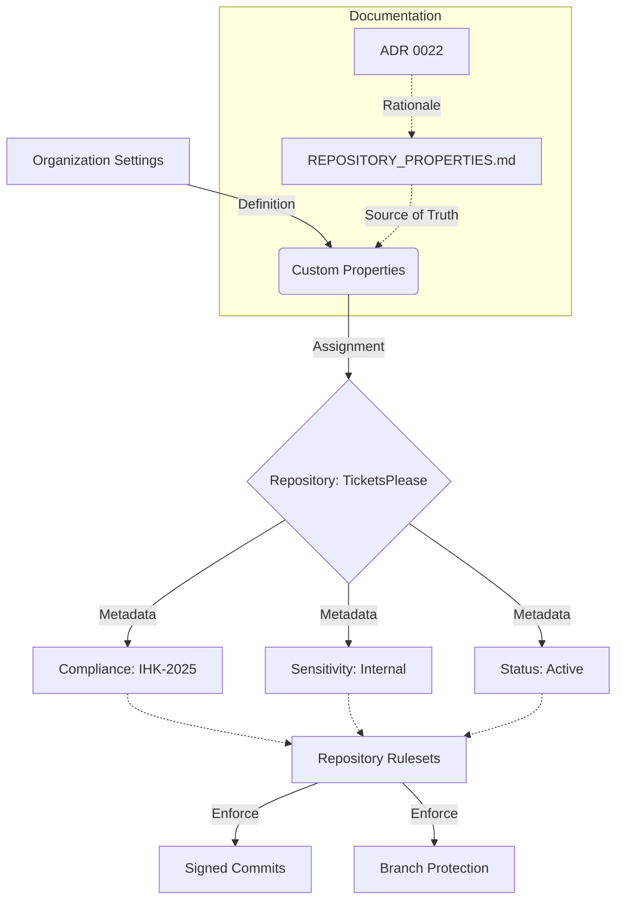

# ADR 0022: GitHub Custom Properties Governance

* Status: accepted
* Deciders: Antigravity, USER
* Date: 2026-03-07

## Context and Problem Statement

As the `TicketsPlease` project scales towards an enterprise-grade repository, the
need for structured metadata increases. GitHub Custom Properties provide a way to
decorate repositories with information such as compliance frameworks (IHK
standards), data sensitivity, and project maturity. However, since these
properties are managed at the organization level and not visible in the codebase
by default, there is a risk of configuration drift and lack of transparency for
developers.

## Decision Drivers

* **Governance**: Alignment with IHK (Industrie- und Handelskammer) documentation standards.
* **Automation**: Enabling repository rulesets to trigger based on metadata.
* **Transparency**: Making repository "decorations" visible and documented as code.
* **Consistency**: Ensuring all project contributors understand the required properties.

## Decision Outcome

Chosen option: "Internal Documentation as Code", because it provides a clear
"Source of Truth" within the repository's `.github` directory, ensuring that
organization-level settings are documented, versioned, and easily understood by
the team.

### Positive Consequences

* **Auditability**: Changes to the expected properties are tracked via Git.
* **Compliance**: Direct mapping to IHK requirements (e.g., project classification).
* **Developer Experience**: New contributors can quickly see the repository's metadata requirements.

### Negative Consequences

* **Manual Sync**: Organization owners must manually ensure the GitHub UI
  settings match the documentation (unless automated via API in the future).

## Logic and Flow

## Proposed Property Schema

| Property | Type | Description | Values (Examples) |
| :-- | :-- | :-- | :-- |
| `repository_type` | Single Select | Architectural classification of the repo. | `frontend`, `backend`, `library`, `infrastructure` |
| `production_state` | Single Select | Lifecycle and stability state. | `internal`, `beta`, `production`, `archived` |
| `data_sensitivity` | Single Select | Data classification level. | `public`, `internal`, `confidential`, `restricted` |
| `ihk_compliance` | Boolean | Whether IHK documentation standards apply. | `true`, `false` |

## Pros and Cons of the Options

### [Internal Documentation as Code]

Manual documentation of organization settings within the repository.

* Good, because it integrates with existing developer workflows (Markdown/Git).
* Good, because it serves as a baseline for future API automation.
* Bad, because it requires manual discipline to keep in sync.
