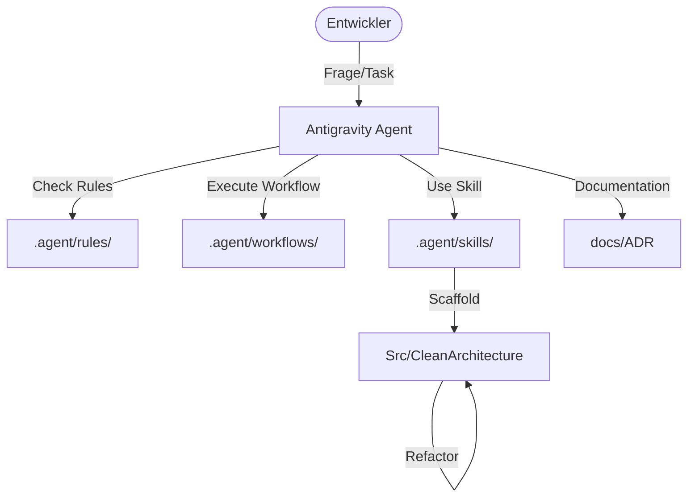

# 🌌 Antigravity AI Guide (Project Hub)

Dieses Dokument beschreibt die Integration der **Antigravity AI Skills** und Workflows im
TicketsPlease Projekt. Die KI agiert hier nicht nur als Chatbot, sondern als vollintegrierter
Pair-Programming-Partner mit Zugriff auf spezialisierte Werkzeuge.

## 🧠 Core Intelligence: Agent Governance

Die gesamte Agenten-Logik ist im Verzeichnis [`.agent/`](.agent) gekapselt:

- **`instructions.md`**: Das zentrale Regelwerk ("Grundgesetz") für die KI.
- **`rules/`**: Modulare Regeln für Clean Architecture, C#, DDD und Testing.
- **`workflows/`**: Automatisierte Ablaufpläne für komplexe Aufgaben (z.B. `/add-cqrs-feature`).

---

## 🛠️ Antigravity Skills

Wir nutzen 6 spezialisierte Skills, um die Entwicklungsgeschwindigkeit und Codequalität zu
maximieren:

| Skill                           | Zweck                                                             | Trigger / Nutzung                |
| :------------------------------ | :---------------------------------------------------------------- | :------------------------------- |
| **Clean Architecture Scaffold** | Erstellt komplette Features über alle Layer (Domain, App, Infra). | Bei neuen User Stories.          |
| **Code-Review**                 | Validiert Änderungen gegen Projekt-Standards (SOLID, Security).   | Vor jedem Commit / PR.           |
| **EF-Core Debugging**           | Analysiert N+1 Probleme und optimiert SQL-Queries.                | Bei Performance-Bottlenecks.     |
| **ADR-Writer**                  | Dokumentiert Architektur-Entscheidungen im Nygard-Format.         | Bei Richtungsentscheidungen.     |
| **Domain Entity Creator**       | Generiert DDD Entities, Value Objects und Events.                 | Wenn neue Domain-Modelle fehlen. |
| **Refactoring Patterns**        | Führt sichere Code-Transformationen durch.                        | Zur Schulden-Reduzierung.        |

---

## 🔄 Standardisierte Workflows

Über sogenannte "Slash-Commands" (Workflows im `.agent/workflows/` Ordner) kann der Agent komplexe
Kettenreaktionen auslösen:

### 1. New CQRS Feature (`/add-cqrs-feature`)

1. Erstellt Command/Query im Application Layer.
2. Implementiert den entsprechenden Handler.
3. Erstellt Unit-Tests für die Logik.
4. Bindet das Feature in den API-Controller ein.

### 2. Documentation Standards (`/documentation-standards`)

- Automatische Generierung von XML-Kommentaren.
- Erstellung von Mermaid-Diagrammen zur Visualisierung von Logikflüssen.
- Aktualisierung von ADRs und Changelogs.

---

## 📊 Visualisierung (Beispiel)

---

> [!TIP] Um einen Skill zu nutzen, fordere den Agenten einfach auf: _"Nutze den Code-Review Skill
> für meine letzten Änderungen"_ oder _"Starte den Workflow für ein neues CQRS Feature:
> CreateTicket"_.
