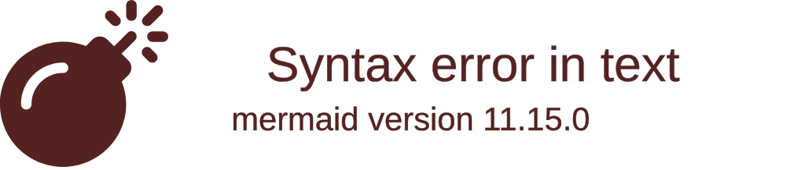
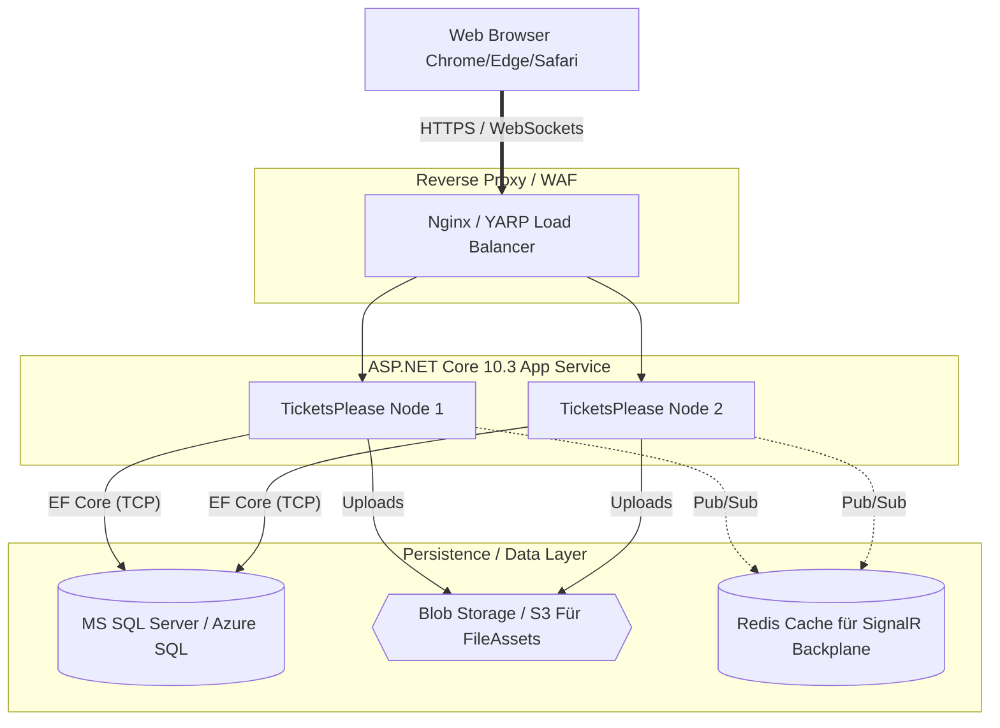
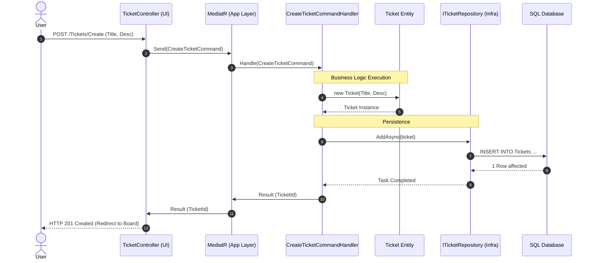

# System Architecture & Infrastructure

Dieses Dokument visualisiert unsere High-Level Architektur (Clean Architecture), das Deployment-Modell und den grundlegenden Datenfluss der Applikation.

## 1. Clean Architecture (Onion) Diagramm

Das folgende Diagramm zeigt die strikte Abhängigkeitsrichtung (Dependency Rule) unserer ASP.NET Core Solution. Abhängigkeiten dürfen **immer nur nach innen** (in Richtung der Domain) zeigen.

## 2. Infrastructure & Deployment Architektur

Dieses UML Deployment-Diagramm veranschaulicht, wie die fertige Applikation in einer Produktionsumgebung (z.B. Azure oder ein lokaler IIS/Docker Swarm) verteilt wird.

## 3. CQRS & Event Flow (Ticket Creation)

Ein Sequenzdiagramm, das den typischen Fluss eines Commands (z.B. "Erstelle ein neues Ticket") durch unsere Clean Architecture Routen zeigt.

