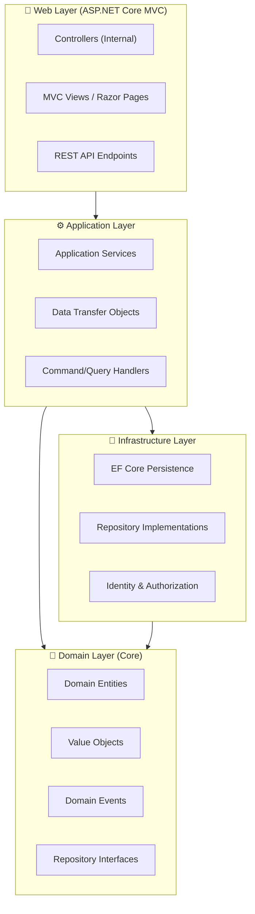
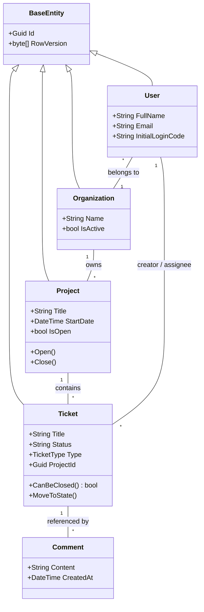
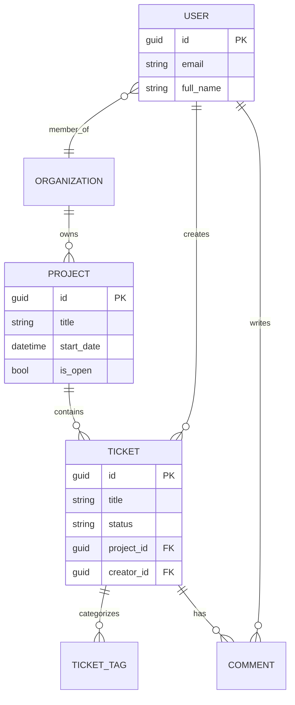
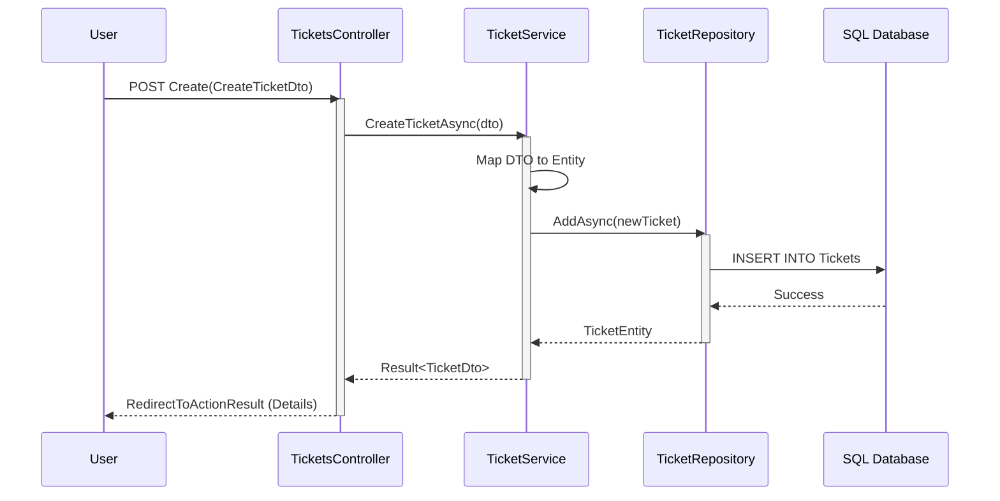

# TicketsPlease: The Big 5 Architecture & Model

Dieses Dokument bietet eine visuelle Übersicht über die Architektur, das Domänenmodell und die Kerninteraktionen von **TicketsPlease**.

---

## 1. System Architecture (DDD & MVC)
Die Anwendung folgt einem klassischen **Layered Architecture**-Ansatz mit strikter Trennung nach **Domain-Driven Design (DDD)**-Prinzipien.



---

## 2. Domain Class Diagram
Das Herzstück des Systems: Die Beziehungen zwischen den wichtigsten Domänen-Entitäten.



---

## 3. Entity Relationship Diagram (ERD)
Fokus auf die Persistenzstrategie und Fremdschlüsselbeziehungen.



---

## 4. Use Case Diagram
Die Rollen und ihre primären Interaktionen mit dem System.

```mermaid
usecaseDiagram
    actor "Admin" as A
    actor "Project Manager" as PM
    actor "Developer" as D
    actor "Stakeholder" as S

    package "TicketsPlease System" {
        usecase "Create Project" as UC1
        usecase "Manage Teams" as UC2
        usecase "Create/Edit Ticket" as UC3
        usecase "Change Ticket State" as UC4
        usecase "Add Comments" as UC5
        usecase "View Dashboard" as UC6
    }

    A --> UC1
    A --> UC2
    PM --> UC1
    PM --> UC3
    PM --> UC4
    D --> UC3
    D --> UC4
    D --> UC5
    S --> UC6
```

---

## 5. Sequence Diagram: Ticket Creation Flow
Demonstration des Workflows über alle Layer hinweg.


