# TicketsPlease: The Big 5 Architecture & Model

Dieses Dokument bietet eine visuelle Übersicht über die Architektur, das Domänenmodell und die
Kerninteraktionen von **TicketsPlease**.

---

## 1. System Architecture (DDD & MVC)

Die Anwendung folgt einem klassischen **Layered Architecture**-Ansatz mit strikter Trennung nach
**Domain-Driven Design (DDD)**-Prinzipien.

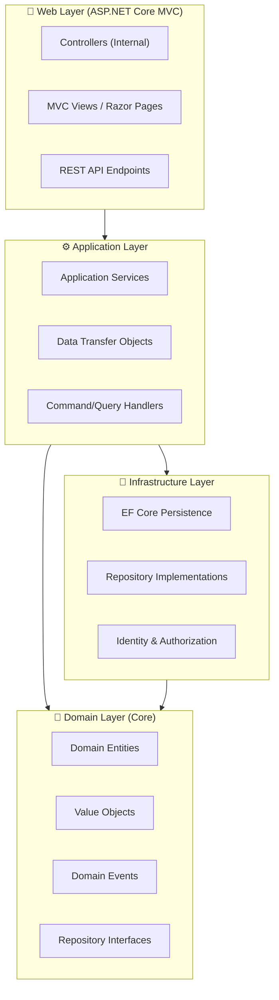

---

## 2. Domain Class Diagram

Das Herzstück des Systems: Die Beziehungen zwischen den wichtigsten Domänen-Entitäten.

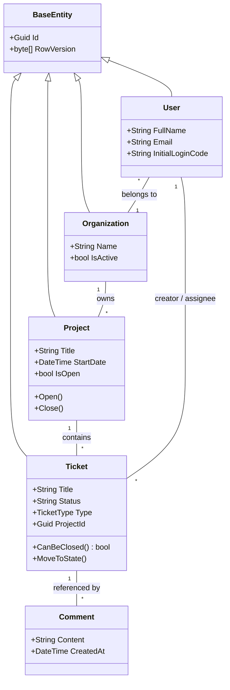

---

## 3. Entity Relationship Diagram (ERD)

Fokus auf die Persistenzstrategie und Fremdschlüsselbeziehungen.

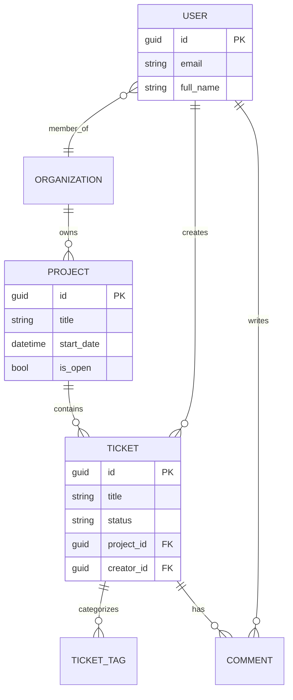

---

## 4. Use Case Diagram

Die Rollen und ihre primären Interaktionen mit dem System.

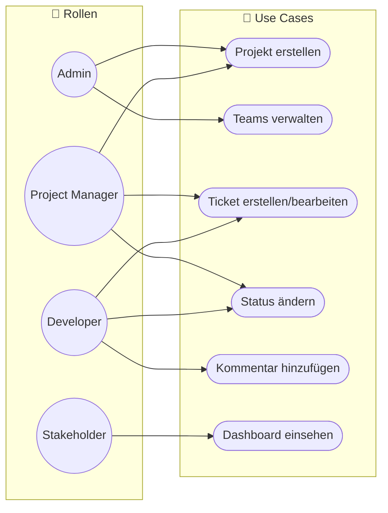

---

## 5. Sequence Diagram: Ticket Creation Flow

Demonstration des Workflows über alle Layer hinweg.

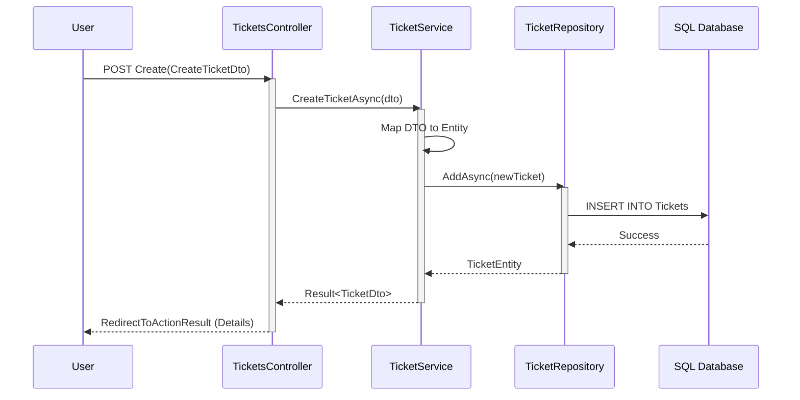

---

## 6. Test Strategy & Coverage

Die Qualitätssicherung erfolgt über eine mehrstufige Testpyramide mit dem Ziel der vollständigen
Abdeckung der Geschäftslogik.

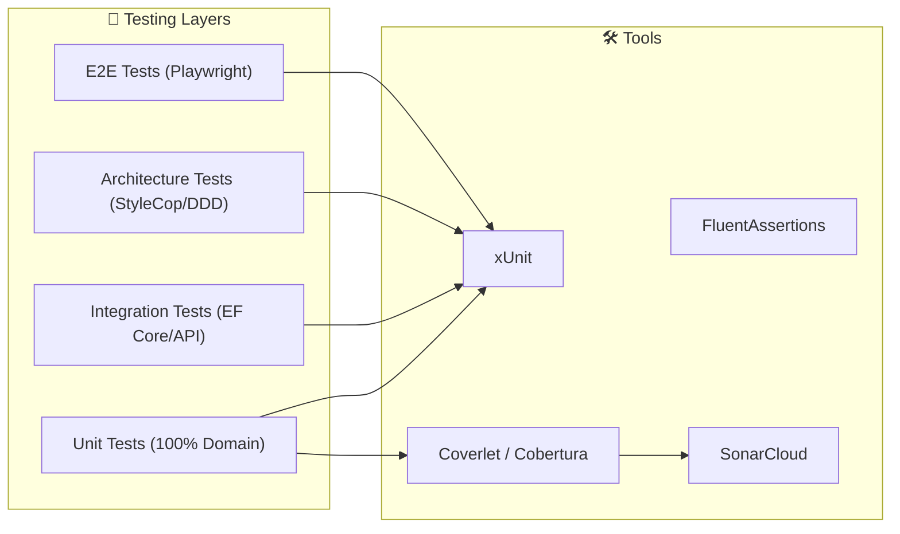

---

## 7. Ticket Lifecycle (State Diagram)

Der Lebenszyklus eines Tickets von der Erstellung bis zur endgültigen Schließung.

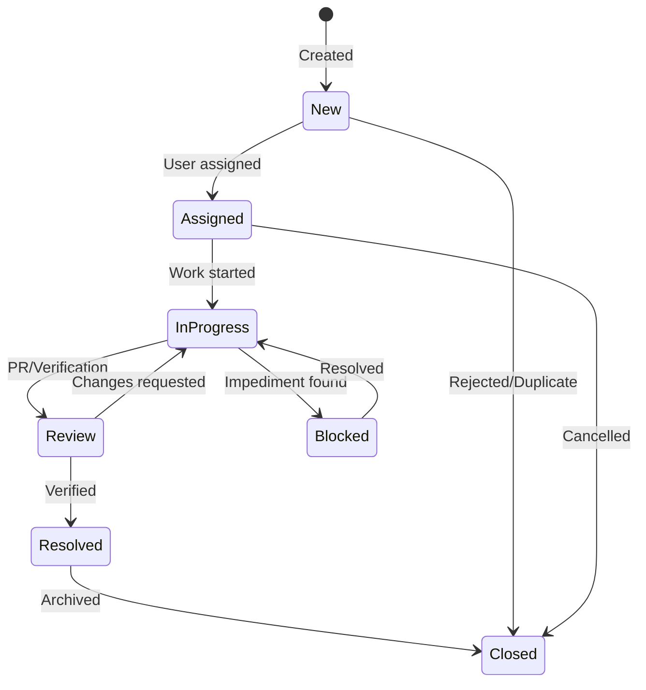

---

## 8. Deployment Architecture

Physische Verteilung der Komponenten in einer Standard-Umgebung.

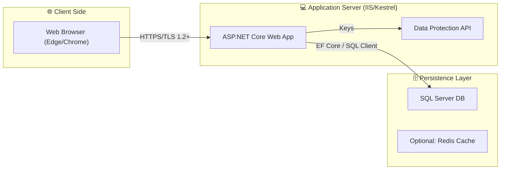

---

## 9. Component Dependency Diagram

Striktes DDD-Abhängigkeitsmodell (Onion Architecture Approach).

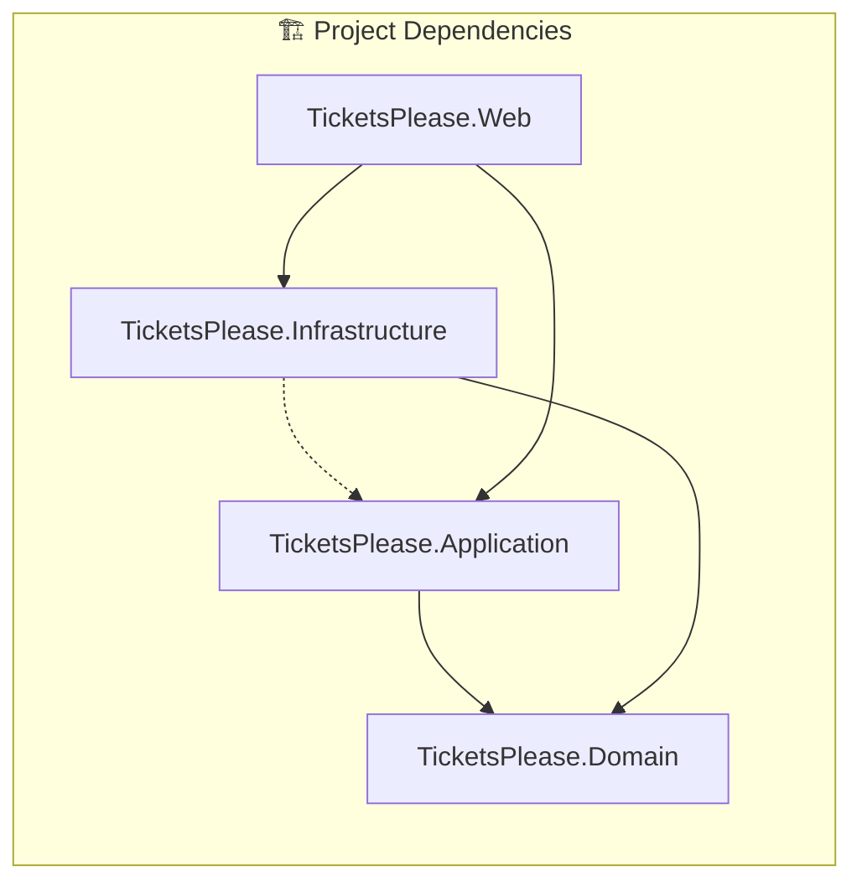

---

## 10. Security & Data Flow (DFD)

Darstellung der Vertrauensgrenzen und des Datenflusses.

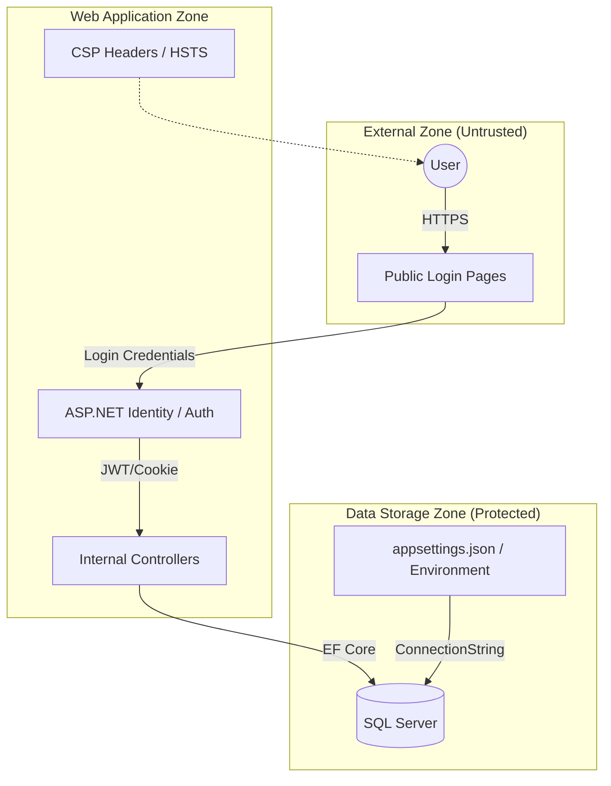

---

## 11. Business Workflow: Organization Setup

Prozessablauf bei der Einrichtung einer neuen Organisation im System.

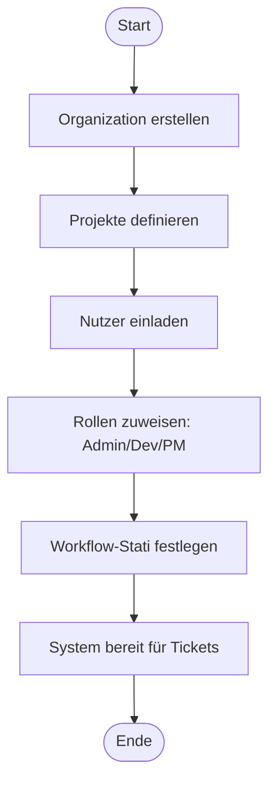
