# 🗄️ Database Schema (ERD)

Die Datenbankstruktur (Entity Framework Core - Code First) ist streng
relational, befindet sich in der **3. Normalform (3NF)** und folgt dem
Enterprise-Grade Design.> [!NOTE] **Warum 3NF und nicht BCNF (Boyce-Codd)?** Wir haben uns bewusst für

> die 3. Normalform entschieden, da sie in einem Ticketsystem die optimale
> Balance zwischen Datenintegrität und Abfrage-Performance (weniger Joins als in
> BCNF) bietet. BCNF würde bei überlappenden zusammengesetzten Schlüsseln (die
> hier kaum vorkommen) zu einer unnötigen Fragmentierung der Tabellen führen,
> was das EF Core Mapping verkompliziert.
>
> Das untenstehende ERD repräsentiert die **Ziel-Architektur (Phase 5)**. Für
> den aktuellen Fortschritt siehe [Aktueller Stand (MVP)](#aktueller-stand-mvp).

## Entity Relationship Diagram (3NF Enterprise Schema)

```mermaid
erDiagram
    %% --- Organizations & Multi-Tenancy ---
    ORGANIZATION {
        Guid Id PK
        string Name
        string SubscriptionLevel "Trial, Basic, Enterprise"
        datetime JoinedAt
        boolean IsActive
    }

    %% --- Identity & Access Management (IAM) ---
    ROLE {
        Guid Id PK
        string Name "Owner, Admin, Mod, Teamlead, User"
        string Description
    }

    USER {
        Guid Id PK
        Guid RoleId FK
        string Username "NOT NULL (Mandatory)"
        string Email "NOT NULL (Mandatory)"
        string PasswordHash
        datetime CreatedAt
        datetime LastLoginAt
        boolean IsOnline "Live Status"
        byte RowVersion "Optimistic Concurrency (Timestamp)"
    }

    USER_PROFILE {
        Guid UserId PK, FK
        string FirstName "NOT NULL (Mandatory)"
        string LastName
        string Bio
        Uri AvatarUrl
        string PhoneNumber
        Guid AvatarImageId FK "Nullable"
        datetime UpdatedAt
    }

    USER_ADDRESS {
        Guid UserId PK, FK
        string Street
        string City
        string ZipCode
        string Country
    }

    %% --- Assets / Files ---
    FILE_ASSET {
        Guid Id PK
        string FileName
        string ContentType
        string BlobPath "Azure/S3/Local Path"
        long SizeBytes
        datetime UploadedAt
        Guid UploadedByUserId FK
    }

    %% --- Teams & Workspaces ---
    PROJECT {
        Guid Id PK
        string Title
        string Description
        datetime StartDate
        datetime EndDate "Nullable"
        boolean IsOpen
        Guid WorkflowId FK "Nullable"
    }

    TEAM {
        Guid Id PK
        string Name
        string Description
        string ColorCode
        datetime CreatedAt
        Guid CreatedByUserId FK
    }

    TEAM_MEMBER {
        Guid TeamId PK, FK
        Guid UserId PK, FK
        datetime JoinedAt
        boolean IsTeamLead
    }

    %% --- Ticket Core Domain ---
    TICKET {
        Guid Id PK
        Guid ProjectId FK
        string Sha1Hash "Unique Identifier / Copy-Ref"
        string Title
        string DescriptionMarkdown
        TicketType Type "Task, Bug, Feature, Epic"
        TicketSize Size "XS, S, M, L, XL"
        int EstimatePoints
        Guid ParentTicketId FK "Hierarchical Parent"
        Guid PriorityId FK
        int ChilliesDifficulty "1-5 🌶️"
        string GeoIpTimestamp "Audit Trail"
        datetime StartDate
        datetime Deadline
        Guid WorkflowStateId FK
        Guid CreatorId FK
        Guid AssignedUserId FK "Nullable"
        datetime CreatedAt
        datetime UpdatedAt
        datetime ClosedAt "Nullable"
        Guid ClosedByUserId FK "Nullable"
        byte RowVersion "Optimistic Concurrency (Timestamp)"
    }

    TICKET_LINK {
        Guid Id PK
        Guid SourceTicketId FK
        Guid TargetTicketId FK
        TicketLinkType LinkType "Blocks, RelatesTo, Duplicates"
    }

    TICKET_ASSIGNMENT {
        Guid TicketId PK, FK
        Guid UserId FK "Nullable"
        Guid TeamId FK "Nullable"
        datetime AssignedAt
    }

    TICKET_PRIORITY {
        Guid Id PK
        string Name "Low, Medium, High, Blocker"
        int LevelWeight
        string ColorHex
    }

    SUBTICKET {
        Guid Id PK
        Guid ParentTicketId FK
        string Title
        boolean IsCompleted
        datetime CreatedAt
        Guid CreatorId FK
    }

    TAG {
        Guid Id PK
        string Name "e.g. #frontend, #bug"
        string ColorHex
    }

    TICKET_TAG {
        Guid TicketId PK, FK
        Guid TagId PK, FK
    }

    TIME_LOG {
        Guid Id PK
        Guid TicketId FK
        Guid UserId FK
        datetime StartedAt
        datetime StoppedAt "Nullable (If running)"
        decimal HoursLogged "Computed"
        string Description "Nullable"
    }

    TICKET_UPVOTE {
        Guid TicketId PK, FK
        Guid UserId PK, FK
        datetime VotedAt
    }

    TICKET_HISTORY {
        Guid Id PK
        Guid TicketId FK
        Guid ActorUserId FK
        string FieldName "e.g. Status, Assignment"
        string OldValue
        string NewValue
        datetime ChangedAt
    }

    TICKET_TEMPLATE {
        Guid Id PK
        string Name "e.g. Bug Report"
        string DescriptionMarkdownTemplate
        Guid DefaultPriorityId FK "Nullable"
        Guid CreatorId FK
    }

    %% --- Workflow / Kanban ---
    WORKFLOW_STATE {
        Guid Id PK
        string Name "Todo, InProgress, Review, Done"
        int OrderIndex
        string ColorHex
        boolean IsTerminalState
    }

    WORKFLOW_TRANSITION {
        Guid FromStateId FK
        Guid ToStateId FK
        Guid AllowedRoleId FK "Nullable (All roles if null)"
    }

    CUSTOM_FIELD_DEFINITION {
        Guid Id PK
        Guid TenantId FK
        string Name "e.g. Software Version"
        string FieldType "Text, Number, Date, List"
        string ConfigurationJson "List options, Validation"
    }

    TICKET_CUSTOM_VALUE {
        Guid TicketId PK, FK
        Guid FieldDefinitionId PK, FK
        string Value "Serialized value"
    }

    SLA_POLICY {
        Guid Id PK
        Guid PriorityId FK
        int ResponseTimeHours
        int ResolutionTimeHours
    }

    %% --- Communication / Messaging ---
    MESSAGE {
        Guid Id PK
        Guid SenderUserId FK
        Guid TicketId FK "Nullable (If ticket comment)"
        Guid TeamId FK "Nullable (If Team broadcast)"
        Guid ReceiverUserId FK "Nullable (If 1-on-1 DM)"
        string BodyMarkdown
        datetime SentAt
        boolean IsEdited
    }

    MESSAGE_READ_RECEIPT {
        Guid MessageId PK, FK
        Guid UserId PK, FK
        datetime ReadAt
    }

    NOTIFICATION {
        Guid Id PK
        Guid UserId FK
        string Title
        string Content
        string TargetUrl "Link to Ticket/Message"
        boolean IsRead
        datetime CreatedAt
    }

    %% --- Relationships ---
    %% IAM
    ROLE ||--o{ USER : has
    USER ||--|| USER_PROFILE : owns
    USER ||--|| USER_ADDRESS : owns

    %% Assets
    FILE_ASSET |o--|| USER_PROFILE : avatar_for
    TICKET ||--o{ FILE_ASSET : attachments
    MESSAGE ||--o{ FILE_ASSET : attachments
    USER ||--o{ FILE_ASSET : uploads

    %% Teams & Projects
    USER ||--o{ TEAM_MEMBER : joins
    TEAM ||--o{ TEAM_MEMBER : contains
    USER ||--o{ TEAM : creates
    ORGANIZATION ||--o{ PROJECT : owns
    PROJECT ||--o{ TICKET : contains

    %% Tickets & Workflow
    USER ||--o{ TICKET : creates
    WORKFLOW_STATE ||--o{ TICKET : groups
    TICKET_PRIORITY ||--o{ TICKET : categorizes
    TICKET ||--o{ SUBTICKET : contains_checklist_items
    TICKET ||--o{ TICKET : "parent_of (Epic/Task Hierarchy)"
    TICKET ||--o{ TICKET_LINK : "blocks / blocked_by"

    %% Assignments (3NF resolution)
    TICKET ||--o{ TICKET_ASSIGNMENT : has
    USER |o--o{ TICKET_ASSIGNMENT : receives
    TEAM |o--o{ TICKET_ASSIGNMENT : receives

    %% Tags
    TICKET ||--o{ TICKET_TAG : matches
    TAG ||--o{ TICKET_TAG : categorizes

    %% Time Logging
    TICKET ||--o{ TIME_LOG : tracks
    USER ||--o{ TIME_LOG : books

    %% Upvoting
    TICKET ||--o{ TICKET_UPVOTE : receives
    USER ||--o{ TICKET_UPVOTE : casts

    %% Messaging
    USER ||--o{ MESSAGE : sends
    TICKET ||--o{ MESSAGE : contains_comments
    TEAM ||--o{ MESSAGE : contains_broadcasts
    MESSAGE ||--o{ MESSAGE_READ_RECEIPT : tracked_by
    USER ||--o{ NOTIFICATION : receives

    %% Audit & SLAs
    TICKET_HISTORY ||--o{ TICKET : generates
    TICKET_PRIORITY ||--o| SLA_POLICY : defines
    TICKET_TEMPLATE ||--o{ TICKET : spawns

    %% Future-Proofing
    ORGANIZATION ||--o{ USER : contains
    ORGANIZATION ||--o{ TICKET : owns
    WORKFLOW_STATE ||--o{ WORKFLOW_TRANSITION : originates
    WORKFLOW_STATE ||--o{ WORKFLOW_TRANSITION : targets
    ORGANIZATION ||--o{ CUSTOM_FIELD_DEFINITION : defines
    TICKET ||--o{ TICKET_CUSTOM_VALUE : has_meta
    CUSTOM_FIELD_DEFINITION ||--o{ TICKET_CUSTOM_VALUE : values_for
```



### 📋 Tabellarische Feld-Übersicht (Enterprise Schema)

| Tabelle           | Feld                | Typ      | Constraint | Beschreibung                      |
| :---------------- | :------------------ | :------- | :--------- | :-------------------------------- |
| **ROLE**          | Id                  | Guid     | PK         | Eindeutige ID der Rolle           |
|                   | Name                | string   |            | z.B. Owner, Admin, Mod, User      |
|                   | Description         | string   |            | Optionale Beschreibung            |
| **USER**          | Id                  | Guid     | PK         | Eindeutige User ID                |
|                   | RoleId              | Guid     | FK         | Verweis auf ROLE.Id               |
|                   | Username            | string   | NOT NULL   | Eindeutiger Login-Name            |
|                   | Email               | string   | NOT NULL   | Eindeutige E-Mail Adresse         |
|                   | PasswordHash        | string   |            | Sicher verschlüsseltes Passwort   |
|                   | CreatedAt           | datetime |            | Erstellungszeitpunkt              |
|                   | LastLoginAt         | datetime |            | Letzter Login-Zeitstempel         |
|                   | IsOnline            | boolean  |            | Aktueller Presence-Status         |
|                   | RowVersion          | byte[]   | Timestamp  | Optimistic Concurrency Token      |
| **USER_PROFILE**  | UserId              | Guid     | PK, FK     | 1:1 zu USER.Id                    |
|                   | FirstName           | string   | NOT NULL   | Vorname                           |
|                   | LastName            | string   |            | Nachname                          |
|                   | Bio                 | string   |            | Biographie                        |
|                   | AvatarUrl           | Uri      |            | URL zum Avatar                    |
|                   | PhoneNumber         | string   |            | Telefonnummer                     |
|                   | AvatarImageId       | Guid     | FK         | Verweis auf FILE_ASSET.Id         |
|                   | UpdatedAt           | datetime |            | Letzte Profilaktualisierung       |
| **FILE_ASSET**    | Id                  | Guid     | PK         | Eindeutige Asset ID               |
|                   | FileName            | string   |            | Ursprünglicher Dateiname          |
|                   | ContentType         | string   |            | MIME-Type (image/png etc.)        |
|                   | BlobPath            | string   |            | Pfad im Storage (S3/Azure/Local)  |
|                   | SizeBytes           | long     |            | Dateigröße in Byte                |
|                   | UploadedAt          | datetime |            | Zeitstempel des Uploads           |
|                   | UploadedByUserId    | Guid     | FK         | Verweis auf USER.Id               |
| **PROJECT**       | Id                  | Guid     | PK         | Eindeutige Projekt ID             |
|                   | Title               | string   |            | Projekttitel                      |
|                   | Description         | string   |            | Projektbeschreibung               |
|                   | StartDate           | datetime |            | Projektstart                      |
|                   | EndDate             | datetime |            | Projektende                       |
|                   | IsOpen              | boolean  |            | Projektstatus                     |
|                   | WorkflowId          | Guid     | FK         | Zugeordneter Workflow             |
| **TICKET**        | Id                  | Guid     | PK         | Eindeutige Ticket ID              |
|                   | ProjectId           | Guid     | FK         | Verweis auf PROJECT.Id            |
|                   | Sha1Hash            | string   | Unique     | Identifier für Referenzen         |
|                   | Title               | string   |            | Kurzer Betreff                    |
|                   | DescriptionMarkdown | string   |            | Ausführliche Beschreibung (MD)    |
|                   | Type                | Enum     |            | Task, Bug, Feature, Epic          |
|                   | Size                | Enum     |            | XS, S, M, L, XL                   |
|                   | EstimatePoints      | int?     |            | Geschätzte Story Points           |
|                   | ParentTicketId      | Guid?    | FK         | Verweis auf das Eltern-Ticket     |
|                   | PriorityId          | Guid     | FK         | Verweis auf TICKET_PRIORITY.Id    |
|                   | ChilliesDifficulty  | int      |            | Schwierigkeit (1-5 🌶️)            |
|                   | GeoIpTimestamp      | string   |            | Audit-Information (Standort/Zeit) |
|                   | StartDate           | datetime |            | Geplanter Start                   |
|                   | Deadline            | datetime |            | Abgabetermin                      |
|                   | WorkflowStateId     | Guid     | FK         | Verweis auf WORKFLOW_STATE.Id     |
|                   | CreatorId           | Guid     | FK         | Verweis auf USER.Id               |
|                   | AssignedUserId      | Guid     | FK         | Zugewiesener Benutzer             |
|                   | CreatedAt           | datetime |            | Erstellungszeitraum               |
|                   | UpdatedAt           | datetime |            | Letzte Änderung                   |
|                   | ClosedAt            | datetime |            | Abschluss-Zeitstempel             |
|                   | ClosedByUserId      | Guid     | FK         | Wer hat das Ticket geschlossen?   |
|                   | RowVersion          | byte[]   | Timestamp  | Optimistic Concurrency Token      |
| **TICKET_LINK**   | Id                  | Guid     | PK         | Eindeutige Link ID                |
|                   | SourceTicketId      | Guid     | FK         | Quell-Ticket                      |
|                   | TargetTicketId      | Guid     | FK         | Ziel-Ticket                       |
|                   | LinkType            | Enum     |            | Blocks, RelatesTo, Duplicates     |
| **MESSAGE**       | Id                  | Guid     | PK         | Eindeutige Nachrichten ID         |
|                   | SenderUserId        | Guid     | FK         | Verweis auf USER.Id               |
|                   | TicketId            | Guid     | FK (Null)  | Kontext: Ticket-Kommentar         |
|                   | TeamId              | Guid     | FK (Null)  | Kontext: Team-Broadcast           |
|                   | ReceiverUserId      | Guid     | FK (Null)  | Kontext: 1:1 Nachricht            |
|                   | BodyMarkdown        | string   |            | Inhalt der Nachricht (MD)         |
|                   | SentAt              | datetime |            | Sendezeitpunkt                    |
|                   | IsEdited            | boolean  |            | Wurde die Nachricht geändert?     |
| **USER_ADDR**     | UserId              | Guid     | PK, FK     | 1:1 zu USER.Id                    |
|                   | Street              | string   |            | Straße                            |
|                   | City                | string   |            | Stadt                             |
|                   | ZipCode             | string   |            | Postleitzahl                      |
|                   | Country             | string   |            | Land                              |
| **SUBTICKET**     | Id                  | Guid     | PK         | Eindeutige Subticket ID           |
|                   | ParentTicketId      | Guid     | FK         | Verweis auf TICKET.Id             |
|                   | Title               | string   |            | Titel des Subtasks                |
|                   | IsCompleted         | boolean  |            | Erledigt-Status                   |
|                   | CreatedAt           | datetime |            | Erstellungszeitraum               |
| **T_TEMPLATE**    | Id                  | Guid     | PK         | Eindeutige Template ID            |
|                   | Name                | string   |            | z.B. Bug Report                   |
|                   | DescriptionTemplate | string   |            | Markdown Template                 |
| **SLA_POLICY**    | Id                  | Guid     | PK         | Eindeutige Policy ID              |
|                   | PriorityId          | Guid     | FK         | Verweis auf TICKET_PRIO.Id        |
|                   | ResponseTimeHours   | int      |            | Reaktionszeit in Std              |
|                   | ResolutionTimeHours | int      |            | Lösungszeit in Std                |
| **MSG_RECEIPT**   | MessageId           | Guid     | PK, FK     | Verweis auf MESSAGE.Id            |
|                   | UserId              | Guid     | PK, FK     | Verweis auf USER.Id               |
|                   | ReadAt              | datetime |            | Gelesen am                        |
| **NOTIFICATION**  | Id                  | Guid     | PK         | Eindeutige ID                     |
|                   | UserId              | Guid     | FK         | Empfänger (USER.Id)               |
|                   | Title               | string   |            | Betreff                           |
|                   | Content             | string   |            | Inhalt der Benachrichtigung       |
|                   | TargetUrl           | string   |            | Deep-Link zum Ticket/Kommentar    |
|                   | IsRead              | boolean  |            | Gelesen-Status                    |
|                   | CreatedAt           | datetime |            | Zeitstempel                       |
| **ORGANIZATION**  | Id                  | Guid     | PK         | Eindeutige Mandanten ID           |
|                   | Name                | string   |            | Firmenname                        |
|                   | SubscriptionLevel   | string   |            | z.B. Enterprise, Basic            |
|                   | IsActive            | boolean  |            | Mandant aktiv?                    |
| **WF_TRANSITION** | FromStateId         | Guid     | FK         | Von Status                        |
|                   | ToStateId           | Guid     | FK         | Zu Status                         |
|                   | AllowedRoleId       | Guid     | FK         | Berechtigte Rolle                 |
| **C_FIELD_DEF**   | Id                  | Guid     | PK         | Eindeutige Feld-Definition        |
|                   | TenantId            | Guid     | FK         | Gehört zu Mandant                 |
|                   | Name                | string   |            | Feldbezeichnung                   |
|                   | FieldType           | string   |            | Typ (Text, List, etc.)            |
| **T_CUSTOM_VAL**  | TicketId            | Guid     | PK, FK     | Verweis auf TICKET.Id             |
|                   | FieldDefinitionId   | Guid     | PK, FK     | Verweis auf C_FIELD_DEF.Id        |
|                   | Value               | string   |            | Tatsächlicher Wert                |
| **TEAM**          | Id                  | Guid     | PK         | Eindeutige Team ID                |
|                   | Name                | string   |            | Name des Teams                    |
|                   | Description         | string   |            | Optionale Beschreibung            |
|                   | ColorCode           | string   |            | Hex-Code für die UI               |
|                   | CreatedAt           | datetime |            | Erstellungszeitpunkt              |
|                   | CreatedByUserId     | Guid     | FK         | Verweis auf USER.Id               |
| **TEAM_MEMBER**   | TeamId              | Guid     | PK, FK     | Verweis auf TEAM.Id               |
|                   | UserId              | Guid     | PK, FK     | Verweis auf USER.Id               |
|                   | JoinedAt            | datetime |            | Beitrittsdatum                    |
|                   | IsTeamLead          | boolean  |            | Hat der User Leitungsrechte?      |
| **TICKET_ASSIGN** | TicketId            | Guid     | PK, FK     | Verweis auf TICKET.Id             |
|                   | UserId              | Guid     | FK (Null)  | Zuweisung an User                 |
|                   | TeamId              | Guid     | FK (Null)  | Zuweisung an Team                 |
|                   | AssignedAt          | datetime |            | Zeitstempel der Zuweisung         |
| **TICKET_PRIO**   | Id                  | Guid     | PK         | Eindeutige ID                     |
|                   | Name                | string   |            | z.B. High, Medium, Low            |
|                   | LevelWeight         | int      |            | Sortier-Gewichtung                |
|                   | ColorHex            | string   |            | Hex-Code für die UI               |
| **TAG**           | Id                  | Guid     | PK         | Eindeutige Tag ID                 |
|                   | Name                | string   |            | z.B. #bug, #frontend              |
|                   | ColorHex            | string   |            | Hex-Code                          |
| **TICKET_TAG**    | TicketId            | Guid     | PK, FK     | Verweis auf TICKET.Id             |
|                   | TagId               | Guid     | PK, FK     | Verweis auf TAG.Id                |
| **TIME_LOG**      | Id                  | Guid     | PK         | Eindeutige Log ID                 |
|                   | TicketId            | Guid     | FK         | Verweis auf TICKET.Id             |
|                   | UserId              | Guid     | FK         | Verweis auf USER.Id               |
|                   | StartedAt           | datetime |            | Beginn der Arbeit                 |
|                   | StoppedAt           | datetime |            | Ende (Null wenn aktiv)            |
|                   | HoursLogged         | decimal  | Computed   | Dauer in Stunden                  |
| **TICKET_UPVOTE** | TicketId            | Guid     | PK, FK     | Verweis auf TICKET.Id             |
|                   | UserId              | Guid     | PK, FK     | Verweis auf USER.Id               |
|                   | VotedAt             | datetime |            | Zeitstempel                       |
| **TICKET_HIST**   | Id                  | Guid     | PK         | Eindeutige History ID             |
|                   | TicketId            | Guid     | FK         | Verweis auf TICKET.Id             |
|                   | ActorUserId         | Guid     | FK         | Wer hat geändert?                 |
|                   | FieldName           | string   |            | Geändertes Feld                   |
|                   | OldValue            | string   |            | Wert vor Änderung                 |
|                   | NewValue            | string   |            | Wert nach Änderung                |
|                   | ChangedAt           | datetime |            | Zeitpunkt der Änderung            |
| **WF_STATE**      | Id                  | Guid     | PK         | Eindeutige Status ID              |
|                   | Name                | string   |            | z.B. Todo, In Progress            |
|                   | OrderIndex          | int      |            | Reihenfolge im Board              |
|                   | ColorHex            | string   |            | UI Farbe                          |
|                   | IsTerminalState     | boolean  |            | Beendet das Ticket? (Done)        |

---

### Detaillierte Entity Beschreibung (3NF & Enterprise Design)

#### 1. Identity & Profile Context (Strikte 3NF)

Um die 3. Normalform (3NF) zu gewährleisten und das System maximal flexibel zu
halten (sowie DSGVO-Löschkonzepte zu vereinfachen), wurde die gigantische
`USER`-Tabelle aufgespalten:

- **User:** Enthält _ausschließlich_ Kern-Authentifizierungsdaten (Ids, Hashes,
  Logins) sowie einen `IsOnline` Indikator für systemweite Presence-Features.
- **UserProfile:** Eine 1:1 Erweiterung, welche die persönlichen
  (nicht-Login-relevanten) Daten hält. Inklusive Referenz auf einen `FILE_ASSET`
  Datensatz für Profilbilder.
- **UserAddress:** Eine eigene 1:1 Tabelle, um Kontaktdaten sauber zu trennen
  (hilft immens beim DSGVO-Export oder Löschen spezifischer Adressdaten).
- **Role:** Echte 1:n Rechteverwaltung für das erweiterte RBAC (Owner, Admin,
  Mod, Teamlead, User). Wird über die "Gruppen- & Rechteverwaltung" im
  Admin-Settings-Menü konfiguriert.

#### 2. Media & Asset Management

- **FileAsset:** Eine zentrale Tabelle für alle unstrukturierten Dateien im
  System. Egal ob Profilbilder (Avatare), Ticket-Anhänge oder in Markdown-Chats
  eingebettete Bilder – alles verweist auf diesen Blob-Storage-Proxy.

#### 3. Team Collaboration Context

- **Team:** Metadaten des Teams.
- **TeamMember:** Die n:m Auflösungstabelle. _Enterprise Feature:_ Enthält nun
  das Flag `IsTeamLead`, um Teamleiter-Rechte direkt an die Knotenpunkte zu
  heften (wichtig für Broadcast-Nachrichten).

#### 4. Ticket Management Context

- **Project:** Repräsentiert die oberste Ebene der Organisation (IHK F2.2). Ein Projekt
  bündelt Tickets und definiert einen spezifischen Zeitrahmen (`StartDate`, `EndDate`)
  sowie einen Standard-Workflow (`WorkflowId`).
- **Ticket:** Das Kern-Aggregat. Unterstützt nun ausdrücklich
  `DescriptionMarkdown`, Hierarchien (Parent/Child) und verschiedene Ticket-Typen
  (Epics, Bugs, etc.). Jedes Ticket wird primär durch einen `Sha1Hash`
  referenziert, der ein einfaches Kopieren und systemweites Tracking erlaubt.
  Außerdem ist für die Revisionssicherheit ein `GeoIpTimestamp` verankert.
  Tickets sind zwingend einem `Project` zugeordnet.
- **TicketLink:** Ermöglicht die Modellierung von Abhängigkeiten (z.B. "Blocked by")
  zwischen Tickets, was für professionelle Kanban-Boards unerlässlich ist.
- **TicketPriority:** Prioritäten wurden aus dem Enum-Status in eine eigene
  Entität ausgelagert (3NF), um Level und Farben dynamisch durch Admins
  definierbar zu machen.
- **TicketAssignment:** Eine eigene Tabelle (statt statischen FKs im
  Ticket-Table). Dies ermöglicht es, Historien zu pflegen ("Wer hatte das Ticket
  vorher?") und es simultan an User _und_ Teams zu hängen.
- **TicketUpvote:** Community-Voting-System. Eine klassische n:m Tabelle, die
  regelt, dass ein User pro Ticket maximal einmal abstimmen (upvoten) darf.
- **TimeLog:** Extrem wichtig für B2B (Abrechnung/Controlling). Erfasst Start,
  Stop, und kalkulierte Stunden pro Benutzer auf ein Ticket.
- **RowVersion (Concurrency):** Alle Domain-Entities verfügen über ein
  `byte[] RowVersion` (Timestamp) Feld zur Vermeidung von Lost-Update-Szenarien
  via EF Core Optimistic Concurrency.

#### 5. Communication & Messaging Engine (Neu 🚀)

Ein völlig neues Bounded Context für die interne Enterprise-Kommunikation.

- **Message:** Ein polymorphes Nachrichten-Objekt. Es versteht volles Markdown
  (und damit Mermaid-Diagramme). Je nachdem, welche Foreign-Keys gesetzt sind,
  agiert die Entität als:
  1. Ticket-Kommentar (`TicketId` != Null)
  2. Direct Message (DM) an Kollegen (`ReceiverUserId` != Null)
  3. Team-Broadcast durch Teamleads (`TeamId` != Null).
- **MessageReadReceipt:** Echte n:m "Gelesen"-Indikatoren, damit Absender (wie
  bei WhatsApp) sehen, wer die Nachricht bereits konsumiert hat.

#### 6. Audit & Compliance Context

- **TicketHistory:** Append-only Tabelle für den unmanipulierbaren Audit Trail
  (Wer hat wann was geändert?). Dieses Log wird global im Admin-Bereich unter
  "Audit Log" visualisiert.

---

## Aktueller Stand (MVP)

Vom oben geplanten Enterprise-Schema sind im Domain Layer **alle 29 Entitäten**
als C#-Klassen vorhanden. Die meisten besitzen jedoch nur minimale Properties
und müssen für den jeweiligen Feature-Sprint ausgebaut werden.

### MVP-relevante Entities (IHK F1–F9)

| Entity | Zweck | IHK-Feature | Status |
|:---|:---|:---|:---|
| **User** | Auth & Zuweisung | F1.3 | ✅ Vorhanden |
| **Ticket** | Kern-Aggregat | F3 | ✅ Vorhanden |
| **Project** | Projekt-Zuordnung | F2.2 | ✅ Vorhanden |
| **WorkflowState** | Status-Verwaltung | F8 | ✅ Vorhanden |
| **Message** | Nachrichten | F9 | ✅ Vorhanden |
| **Notification** | Benachrichtigungen | — | ✅ Vorhanden |

### Aktuelle Ticket Entity

```csharp
public class Ticket : BaseAuditableEntity
{
    public string Title { get; private set; }
    public string DescriptionMarkdown { get; private set; }
    public TicketType Type { get; private set; }
    public TicketSize Size { get; private set; }
    public int? EstimatePoints { get; private set; }
    public Guid? ParentTicketId { get; private set; }
    public Ticket? ParentTicket { get; private set; }
    public ICollection<Ticket> SubTickets { get; private set; }
    public ICollection<TicketLink> BlockedBy { get; private set; }
    public ICollection<TicketLink> Blocking { get; private set; }
}
```

### Aktuelle User Entity

```csharp
public class User : BaseEntity
{
    public string DisplayName { get; set; }
    public string Email { get; set; }
    public bool IsActive { get; set; }
}
```

### Base Entity (Common)

Alle Entitäten erben von `BaseEntity` (Domain Layer). Zur Sicherstellung der
Zukunftssicherheit (ADR-0032) enthält diese nun:

- `Guid Id` (Primary Key)
- `Guid TenantId` (Multi-Tenancy Discriminator)
- `bool IsDeleted` (Soft-Delete Flag)
- `DateTime? DeletedAt` (Soft-Delete Audit)
- `byte[] RowVersion` (Concurrency Token)

### Enterprise-Entities (Post-MVP, bereits im Domain Layer)

Die folgenden Entities sind als Klassen vorhanden, werden aber erst in
Phase 2–5 mit UI und Business-Logik ausgebaut:

- UserProfile, UserAddress, Role, Organization
- FileAsset, Team, TeamMember
- TicketAssignment, TicketPriority, TicketTag, Tag
- SubTicket, TicketUpvote, TicketHistory, TicketTemplate
- TimeLog, TicketCustomValue, CustomFieldDefinition
- WorkflowTransition, SlaPolicy, MessageReadReceipt

---

## Zukunftssicherheit & Erweiterbarkeit (Enterprise Hub)

Zusätzlich zum relationalen Kern wurden folgende Konzepte für die Skalierung
integriert:

1. **Mandantenfähigkeit (Multi-Tenancy):** Durch die `ORGANIZATION` Entität und
   die `TenantId` in jedem Datensatz können Daten physisch in einer DB bleiben,
   aber logisch strikt getrennt werden.
2. **Workflow Engine:** Die `WORKFLOW_TRANSITION` Tabelle erlaubt es, dynamische
   Business-Regeln zu hinterlegen, welche Status-Wechsel für welche Rollen
   zulässig sind.
3. **Custom Field Engine:** Über `CUSTOM_FIELD_DEFINITION` können pro Mandant
   unbegrenzt viele eigene Ticket-Felder definiert werden, ohne Code-Änderungen
   oder Migrationen.
4. **Data Seeding & Synthetic Strategy (Bogus):** Um die Entwicklung zu
   beschleunigen und gleichzeitig die **DSGVO-Konformität (Privacy by Design)**
   zu gewährleisten, setzen wir auf das automatische Seeding mit der **Bogus**
   Bibliothek. Details siehe unten.

---

## 🧪 Data Seeding & Synthetic Strategy (Bogus)

Um die Entwicklung zu beschleunigen und gleichzeitig die **DSGVO-Konformität
(Privacy by Design)** zu gewährleisten, setzen wir auf das automatische Seeding
mit der **Bogus** Bibliothek.

### Seeding Prinzipien

1. **Strictly Development:** Das Seeding wird nur im `Development` Environment
   ausgeführt (siehe `Program.cs`).
2. **Synthetic Only:** Es werden niemals echte Kundendaten für Tests verwendet.
3. **German Locale:** Wir nutzen das `de` Locale für realistische deutsche
   Namen, Adressen und Texte.

### Implementierte Faker-Sets

Aktuell werden folgende Daten automatisch generiert:

- **Tickets:**
  - `Title`: Zufällige Produktnamen/Betreffs.
  - `Description`: Mehrere Paragraphen Lorem Ipsum (DE).
  - `Status`: Zufällig verteilt auf `Todo`, `Doing`, `Done`.
  - `Priority`: Gewichteter Zufallswert (0-5).

### Erweiterungsplan (Phase 2)

Geplant ist die Erweiterung des Seeders auf den vollständigen `Organization` und
`User` Kontext, um komplexere Beziehungen und Berechtigungen im ERD (oben)
direkt nach dem Start testen zu können.

> [!TIP] Die Seeding-Logik befindet sich zentral in der
> `TicketsPlease.Infrastructure.Persistence.DbInitialiser.cs`.
