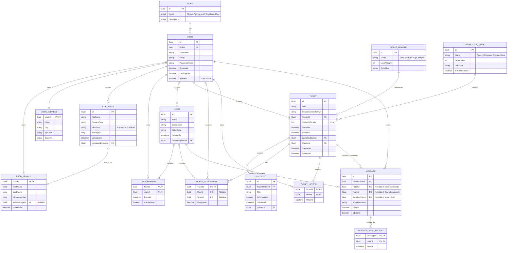

## 🗄️ Datenbankschema & Entities (ERD)

Die Datenbankstruktur (Entity Framework Core - Code First) ist streng relational, befindet sich in der **3. Normalform (3NF)** und ist zukunftssicher (Enterprise-Grade) für hohe Datenmengen und schnelle Abfragen ausgelegt.

### Entity Relationship Diagram (3NF Enterprise Schema)

### Detaillierte Entity Beschreibung (3NF & Enterprise Design)

#### 1. Identity & Profile Context (Strikte 3NF)
Um die 3. Normalform (3NF) zu gewährleisten und das System maximal flexibel zu halten (sowie DSGVO-Löschkonzepte zu vereinfachen), wurde die gigantische `USER`-Tabelle aufgespalten:
*   **User:** Enthält *ausschließlich* Kern-Authentifizierungsdaten (Ids, Hashes, Logins) sowie einen `IsOnline` Indikator für systemweite Presence-Features.
*   **UserProfile:** Eine 1:1 Erweiterung, welche die persönlichen (nicht-Login-relevanten) Daten hält. Inklusive Referenz auf einen `FILE_ASSET` Datensatz für Profilbilder.
*   **UserAddress:** Eine eigene 1:1 Tabelle, um Kontaktdaten sauber zu trennen (hilft immens beim DSGVO-Export oder Löschen spezifischer Adressdaten).
*   **Role:** Echte 1:n Rechteverwaltung für das erweiterte RBAC (Owner, Admin, Mod, Teamlead, User).

#### 2. Media & Asset Management
*   **FileAsset:** Eine zentrale Tabelle für alle unstrukturierten Dateien im System. Egal ob Profilbilder (Avatare), Ticket-Anhänge oder in Markdown-Chats eingebettete Bilder – alles verweist auf diesen Blob-Storage-Proxy.

#### 3. Team Collaboration Context
*   **Team:** Metadaten des Teams.
*   **TeamMember:** Die n:m Auflösungstabelle. *Enterprise Feature:* Enthält nun das Flag `IsTeamLead`, um Teamleiter-Rechte direkt an die Knotenpunkte zu heften (wichtig für Broadcast-Nachrichten).

#### 4. Ticket Management Context
*   **Ticket:** Das Kern-Aggregat. Unterstützt nun ausdrücklich `DescriptionMarkdown`.
*   **TicketPriority:** Prioritäten wurden aus dem Enum-Status in eine eigene Entität ausgelagert (3NF), um Level und Farben dynamisch durch Admins definierbar zu machen.
*   **TicketAssignment:** Eine eigene Tabelle (statt statischen FKs im Ticket-Table). Dies ermöglicht es, Historien zu pflegen ("Wer hatte das Ticket vorher?") und es simultan an User *und* Teams zu hängen.
*   **TicketUpvote:** Community-Voting-System. Eine klassische n:m Tabelle, die regelt, dass ein User pro Ticket maximal einmal abstimmen (upvoten) darf.

#### 5. Communication & Messaging Engine (Neu 🚀)
Ein völlig neues Bounded Context für die interne Enterprise-Kommunikation.
*   **Message:** Ein polymorphes Nachrichten-Objekt. Es versteht volles Markdown (und damit Mermaid-Diagramme). Je nachdem, welche Foreign-Keys gesetzt sind, agiert die Entität als:
    1.  Ticket-Kommentar (`TicketId` != Null)
    2.  Direct Message (DM) an Kollegen (`ReceiverUserId` != Null)
    3.  Team-Broadcast durch Teamleads (`TeamId` != Null).
*   **MessageReadReceipt:** Echte n:m "Gelesen"-Indikatoren, damit Absender (wie bei WhatsApp) sehen, wer die Nachricht bereits konsumiert hat.
