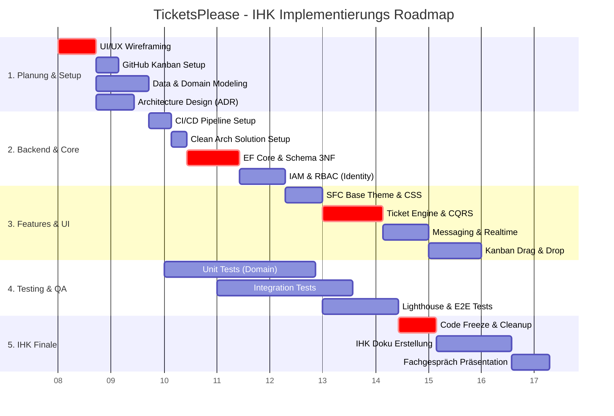

# Projekt Gantt-Chart (IHK Roadmap)

Dieses Gantt-Diagramm visualisiert die Zeitplanung (Roadmap) für das IHK Abschlussprojekt.

```mermaid
gantt
    title TicketsPlease - IHK Implementierungs Roadmap
    dateFormat  YYYY-MM-DD
    axisFormat  %W

    section 1. Planung & Setup
    UI/UX Wireframing           :crit, p1, 2026-03-01, 5d
    GitHub Kanban Setup         :p2, after p1, 3d
    Data & Domain Modeling      :p3, after p1, 7d
    Architecture Design (ADR)   :p4, after p1, 5d

    section 2. Backend & Core
    CI/CD Pipeline Setup        :b1, after p3, 3d
    Clean Arch Solution Setup   :b2, after b1, 2d
    EF Core & Schema 3NF        :crit, b3, after b2, 7d
    IAM & RBAC (Identity)       :b4, after b3, 6d

    section 3. Features & UI
    SFC Base Theme & CSS        :f1, after b4, 5d
    Ticket Engine & CQRS        :crit, f2, after f1, 8d
    Messaging & Realtime        :f3, after f2, 6d
    Kanban Drag & Drop          :f4, after f3, 7d

    section 4. Testing & QA
    Unit Tests (Domain)         :t1, 2026-03-15, 20d
    Integration Tests           :t2, 2026-03-22, 18d
    Lighthouse & E2E Tests      :t3, 2026-04-05, 10d

    section 5. IHK Finale
    Code Freeze & Cleanup       :crit, i1, 2026-04-15, 5d
    IHK Doku Erstellung         :i2, after i1, 10d
    Fachgespräch Präsentation   :i3, after i2, 5d
```
