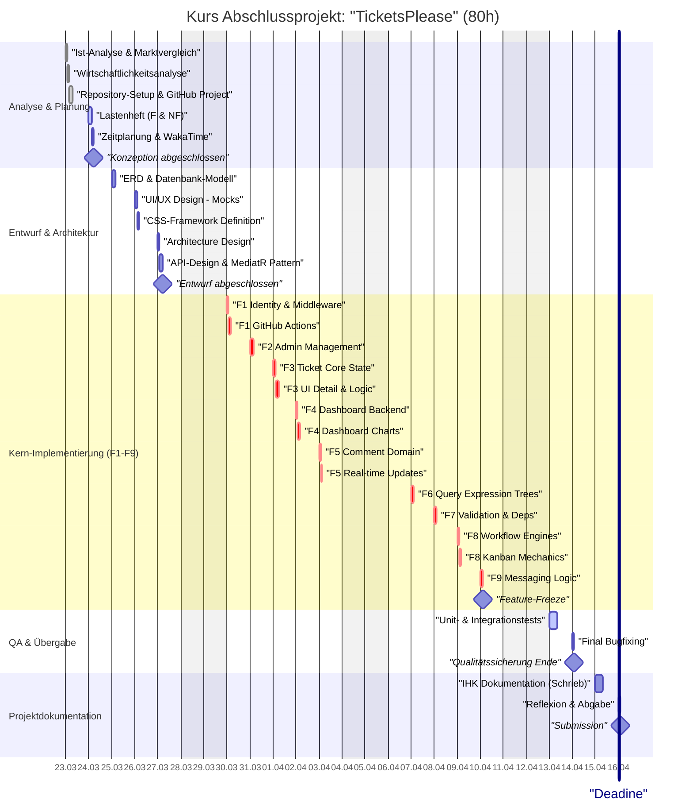

# Dokumentation: TicketsPlease

## **1. Einleitung**

### **1.1. Ausgangssituation**

Im Rahmen der Umschulung zum Fachinformatiker für Anwendungsentwicklung befasst sich dieses
Abschlussprojekt mit der Entwicklung eines ticketbasierten Aufgabenmanagementsystems bei der
**Beispiel GmbH**.

Die **Beispiel GmbH** ist ein junges, aufstrebendes IT-Unternehmen mit Sitz im Herzen von Neuss.
Seit ihrer Gründung im Jahr 2025 hat sich die Firma darauf spezialisiert, maßgeschneiderte
Webanwendungen und anspruchsvolle Unternehmenslösungen zu entwickeln. **14 Mitarbeiter**,
bestehend aus Backend- und Frontend-Entwicklern, UI/UX-Designern, Projektmanagern und
Content-Spezialisten, arbeiten vorwiegend für Kunden aus dem produzierenden Gewerbe, der Logistik
und der Edutainment-Branche.

Aufgrund des stetigen Wachstums und der zunehmenden Komplexität interner und externer Projekte wurde
die Beispiel GmbH von einem langjährigen Partner aus der Logistikbranche beauftragt, ein
spezialisiertes Ticketsystem zu entwickeln, das exakt auf deren granulare Workflows zugeschnitten ist.

Zu den Stakeholdern des Projekts zählen:

- Der Auftraggeber (Logistik-Partner): Vertreten durch den Projektleiter IT.
- Die firmeninterne Qualitätssicherung der Beispiel GmbH.

### **1.2. Projektidee und Zielsetzung**

Ziel des Projektes ist die Entwicklung der Webanwendung "TicketsPlease". Die Anwendung soll als
zentrales Werkzeug zur Erfassung, Verwaltung und Nachverfolgung von Fehlern (Bugs) und Aufgaben
(Tasks) innerhalb von Softwareprojekten dienen. Kernfunktionen umfassen eine Projektverwaltung, ein
detailliertes Ticket-Management mit Zuweisungslogik, Kommentarfunktionen sowie ein flexibles
Workflow-System zur Abbildung individueller Geschäftsprozesse. Die Anwendung wird als ASP.NET Core
MVC Applikation konzipiert, um eine hohe Performance und Wartbarkeit in Unternehmensinfrastrukturen
zu gewährleisten.

### **1.3 Projektbegründung**

Effizientes Projektmanagement erfordert eine lückenlose Dokumentation von Fehlern und Anforderungen.
Bestehende Lösungen sind oft entweder zu komplex (Overhead) oder bieten nicht die nötige Flexibilität
für spezialisierte Workflows. Durch die Eigenentwicklung "TicketsPlease" auf Basis moderner
Webtechnologien (ASP.NET Core 8/10, Entity Framework Core) wird eine Lösung geschaffen, die exakt
die benötigten Features ohne unnötigen Ballast bereitstellt. Dies führt zu einer signifikanten
Zeitersparnis bei der Ticketbearbeitung und dient gleichzeitig der Beispiel GmbH als Referenz für
robuste Enterprise-Backend-Lösungen.

### **1.4 Make-or-Buy Entscheidung**

Im Vorfeld wurde geprüft, ob der Einsatz von Standard-Lösungen wie Jira, Redmine oder GitHub Issues
sinnvoll ist (Buy). Die Entscheidung fiel zugunsten einer Eigenentwicklung (Make) aus folgenden
Gründen:

**Datensouveränität & Security:** Da sensible Projektdaten und interne Logistikprozesse abgebildet
werden, forderte der Kunde ein Hosting in der eigenen On-Premise-Infrastruktur ohne Abhängigkeit von
Drittanbietern oder Cloud-Modellen.

**Spezialisierte Workflows:** Standard-Tools erfordern oft eine Anpassung der Unternehmensprozesse
an die Software. "TicketsPlease" erlaubt es hingegen, die Software modular an die existierenden,
hochspezialisierten Workflows des Kunden anzupassen (Modularität).

**Wirtschaftlichkeit:** Bei einer unbegrenzten Anzahl an Benutzern und Projekten entfallen laufende
Lizenzkosten. Die einmaligen Entwicklungskosten amortisieren sich bereits nach einem Jahr gegenüber
vergleichbaren Enterprise-Lizenzen.

---

## **2. Projektplanung**

### **2.1 Ist-Analyse**

Bisher erfolgt die Fehlererfassung beim Kunden manuell über Tabellenkalkulationen (Excel) und
E-Mail-Verkehr. Dies führt zu Inkonsistenzen, fehlender Rückverfolgbarkeit und Verzögerungen in der
Kommunikation. Es existiert keine zentrale Codebasis für ein Ticket-Management
("Greenfield Project").

**Technische Ausgangslage:**

- Entwickler-Workstation mit Windows 11 und Rocky Linux 10.
- Zugriff auf .NET SDK 10, Visual Studio 2022 / JetBrains Rider.
- **Infrastruktur-Setup:** Vollständig eingerichtetes GitHub-Repository mit `.github` Templates (Issue/PR).
- **Time-Management:** Integriertes Tracking über **WakaTime** für präzise Zeitaufwandsanalysen.
- **IDE-Standardisierung:** Gemeinsame Konfigurationen für `.vs`, `.vscode` und `.idea` (Shared Settings/EditorConfig).
- Bestehende CI/CD Pipeline (GitHub Actions) für automatisierte Tests und Deployments.

### **2.2. Soll-Analyse**

Die zu entwickelnde Webanwendung "TicketsPlease" muss folgende funktionale Anforderungen (MVP)
erfüllen:

**Funktionale Anforderungen:**

1. **Web-Anwendung (F1):** ASP.NET Core 8/10 Basis mit SQL Server & Identity.
2. **Admin-Bereich (F2):** Stammdatenverwaltung und Projekte CRUD.
3. **Ticket-Management (F3):** Erfassung, Bearbeitung und Detailansicht von Tickets.
4. **Dashboard (F4):** Startseite mit Projekt- und Ticket-Statistiken.
5. **Kommentarsystem (F5):** Chronologische Diskussionen innerhalb der Tickets.
6. **Filtersystem (F6):** Granulare Filterung nach Projekten, Erstellern und Bearbeitern.
7. **Abhängigkeiten (F7):** Blockier-Logik zwischen Tickets zur Steuerung der Reihenfolge.
8. **Workflow-Engine (F8):** Definierbare Prozesszustände (Status) pro Projekt.
9. **Messaging (F9):** Benutzerübergreifender Nachrichtenaustausch außerhalb von Tickets.

**Nicht-funktionale Anforderungen:**

- **Technologie:** ASP.NET Core (MVC), Entity Framework Core (Code First).
- **Architektur:** Clean Architecture (Domain Driven Design Ansätze).
- **UI/UX:** Responsive Design mit Tailwind CSS (Corporate Design).
- **Qualität:** Hohe Testabdeckung und automatisierte CI/CD Pipeline (GitHub Actions).
- **Projektmanagement:** Agiles Kanban-Board via **GitHub Projects** mit Issue-Abhängigkeiten (Parent/Child/Blocked).

### **2.3 Zeitplanung**

Die Gesamtdauer des Projektes ist auf **80 Stunden** festgeschrieben.

| **Phase**                      | **Tätigkeit**                                         | **Zeit (h)** | **Startdatum** |
| :----------------------------- | :---------------------------------------------------- | :----------: | :------------: |
| **1. Analyse & Planung**       |                                                       | **12 h**     | **23.03.2026** |
|                                | Ist-Analyse & Marktvergleich                          | 2 h          | 23.03.2026     |
|                                | Wirtschaftlichkeitsanalyse (ROI / Make-or-Buy)        | 2 h          | 23.03.2026     |
|                                | Repository-Setup & GitHub Project (Kanban)            | 3 h          | 23.03.2026     |
|                                | Lastenheft: Funktional vs. Nicht-funktional           | 3 h          | 24.03.2026     |
|                                | Zeit- & Ressourcenplanung (Gantt, WakaTime Setup)     | 2 h          | 24.03.2026     |
| **2. Entwurf**                 |                                                       | **14 h**     | **25.03.2026** |
|                                | Datenbankmodellierung (ERD, Relationen)               | 4 h          | 25.03.2026     |
|                                | UI/UX Design: Wireframes & Corporate Skin             | 3 h          | 26.03.2026     |
|                                | IDE-Konfiguration & CI/CD Workflow-Definition         | 2 h          | 26.03.2026     |
|                                | Architecture Design (Clean Arch Layering)             | 2 h          | 27.03.2026     |
|                                | API-Design & MediatR Pattern Definition               | 3 h          | 27.03.2026     |
| **3. Implementierung (F1-F9)** |                                                       | **34 h**     | **30.03.2026** |
|                                | F1: SDK Setup & Identity (Auth Middleware)            | 2 h          | 30.03.2026     |
|                                | F1: Shared Projects, GitHub Actions & Env-Setup       | 2 h          | 30.03.2026     |
|                                | F2: Admin: CRUD Logik (Projekte & Benutzer)           | 4 h          | 31.03.2026     |
|                                | F3: Ticket-Core: State Machine & Aggregates           | 3 h          | 01.04.2026     |
|                                | F3: Ticket-Detailview & Edit-Logik                    | 3 h          | 01.04.2026     |
|                                | F4: Dashboard: SQL-Aggregation & View-Components       | 2 h          | 02.04.2026     |
|                                | F4: Dashboard: UI-Charts Integration                  | 2 h          | 02.04.2026     |
|                                | F5: Kommentare: Domain Events & Persistence           | 2 h          | 03.04.2026     |
|                                | F5: Kommentare: Real-time UI Updates                  | 1 h          | 03.04.2026     |
|                                | F6: Filter: Expression Trees & Query Extensions       | 3 h          | 07.04.2026     |
|                                | F7: Abhängigkeiten: Validation Logik & UI             | 3 h          | 08.04.2026     |
|                                | F8: Workflow: Status-Transition Guards                | 2 h          | 09.04.2026     |
|                                | F8: Kanban-Drag&Drop Integration                      | 2 h          | 09.04.2026     |
|                                | F9: Messaging: Entity Design & DB-Repository          | 3 h          | 10.04.2026     |
| **4. Qualitätssicherung**       |                                                       | **10 h**     | **13.04.2026** |
|                                | Unit-Testing: Domain Logic & Commands                 | 4 h          | 13.04.2026     |
|                                | Integrationstests: SQL & Repositories                 | 4 h          | 14.04.2026     |
|                                | Finales Bugfixing & Dokumentations-Cleanup            | 2 h          | 14.04.2026     |
| **5. Dokumentation**            |                                                       | **10 h**     | **15.04.2026** |
|                                | IHK Projektdokumentation (Endredaktion)               | 8 h          | 15.04.2026     |
|                                | Fazit, Reflexion & Abgabe                             | 2 h          | 16.04.2026     |
| **Gesamt**                     |                                                       | **80 h**     |                |

---

### **2.4 Kostenplanung**

Die Kalkulation erfolgt auf Basis des Praktikumsbetriebs.

**Personalkosten:**

- Fachinformatiker (Stundenverrechnungssatz): 9,00 €/h
- Geplante Stunden: 80 h
- **Summe Personal: 720,00 €**

**Sachmittelkosten:**

- Infrastruktur-Pauschale (Server, Strom, Arbeitsplatz): 150,00 €
- **Summe Sachmittel: 150,00 €**

#### Gesamtkosten (Plan): 870,00 €
