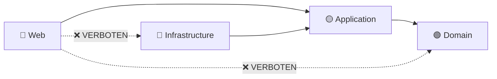
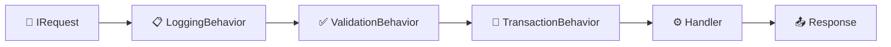
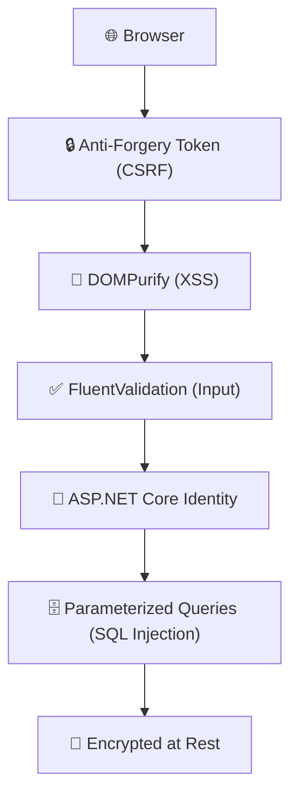
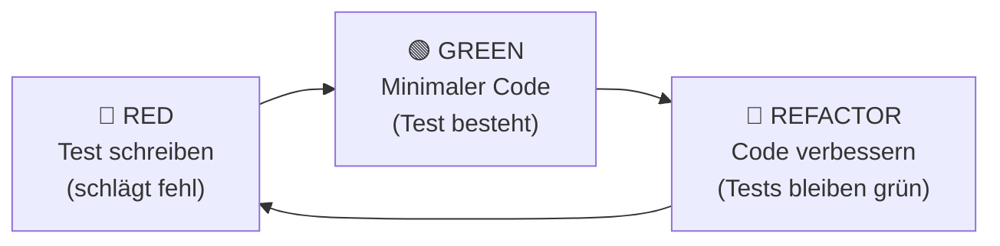
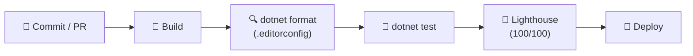
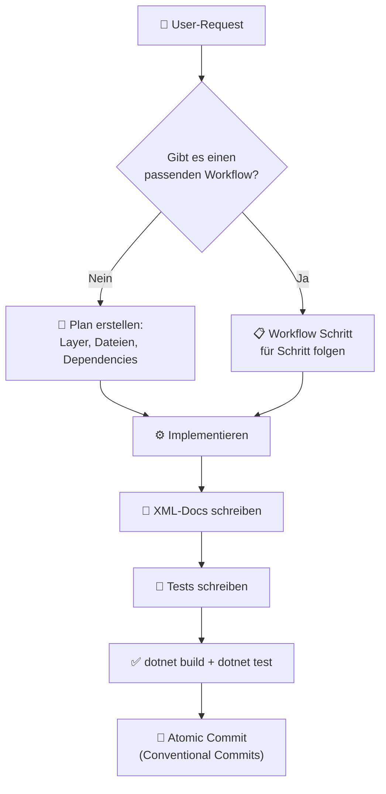

# 🤖 TicketsPlease – Ultimate Agent Governance (v3.0)

Dieses Dokument ist das **oberste Gesetz** für alle KI-gesteuerten
Code-Modifikationen in der **TicketsPlease** Solution. Jede Regel ist aus der
[README.md](README.md), den
[Docs](docs/) und den
[ADRs](docs/adr/) extrahiert.

> [!CAUTION] Verstöße gegen diese Regeln führen zu **sofortigem Reject** im
> Code-Review und blockieren die CI/CD-Pipeline.

---

## 📋 Table of Contents

- [🤖 TicketsPlease – Ultimate Agent Governance (v3.0)](#-ticketsplease--ultimate-agent-governance-v30)
  - [📋 Table of Contents](#-table-of-contents)
  - [1. 🚀 Projekt-Kontext \& Tech-Stack](#1--projekt-kontext--tech-stack)
    - [Projekt-Struktur (Strikte Layer-Zuordnung)](#projekt-struktur-strikte-layer-zuordnung)
    - [Phase-Awareness (MVP vs. Enterprise)](#phase-awareness-mvp-vs-enterprise)
  - [2. 🏛️ Clean Architecture Governance](#2-️-clean-architecture-governance)
    - [Dependency Rule (Unverletzlich)](#dependency-rule-unverletzlich)
    - [Naming Conventions (.editorconfig enforced)](#naming-conventions-editorconfig-enforced)
  - [3. 🧬 Domain-Driven Design (DDD)](#3--domain-driven-design-ddd)
    - [Rich Domain Models (Keine anämischen Modelle!)](#rich-domain-models-keine-anämischen-modelle)
    - [Ticket Close-Rules (Geschäftsregel!)](#ticket-close-rules-geschäftsregel)
    - [Bounded Contexts](#bounded-contexts)
  - [4. ⚡ CQRS \& MediatR Pipeline](#4--cqrs--mediatr-pipeline)
    - [Pipeline Execution Order](#pipeline-execution-order)
  - [5. 🗄️ EF Core Strict Policy](#5-️-ef-core-strict-policy)
  - [6. 🛡️ Security (Defense in Depth)](#6-️-security-defense-in-depth)
    - [Schichtenmodell](#schichtenmodell)
  - [7. 🎨 UI/UX Excellence (Tailwind Way)](#7--uiux-excellence-tailwind-way)
    - [Fundamentale Regeln](#fundamentale-regeln)
    - [CSS-Architektur](#css-architektur)
    - [SFC \& Razor Partials (DRY)](#sfc--razor-partials-dry)
    - [Theme-Switching (Dark/Light Mode)](#theme-switching-darklight-mode)
    - [Micro-Animations \& Premium Feeling](#micro-animations--premium-feeling)
  - [8. ♿ Accessibility (BFSG / a11y)](#8--accessibility-bfsg--a11y)
  - [9. 🌐 Internationalisierung (I18N)](#9--internationalisierung-i18n)
  - [10. 🧪 Testing Excellence (TDD)](#10--testing-excellence-tdd)
    - [TDD-Zyklus (Pflicht!)](#tdd-zyklus-pflicht)
  - [11. 💻 Technical Excellence](#11--technical-excellence)
    - [Asynchronität \& Performance](#asynchronität--performance)
    - [Clean Code Prinzipien](#clean-code-prinzipien)
  - [12. 🤝 Git \& CI/CD Governance](#12--git--cicd-governance)
    - [Branching Strategy](#branching-strategy)
    - [Conventional Commits](#conventional-commits)
    - [CI/CD Quality Gates](#cicd-quality-gates)
  - [13. 📝 Enterprise Dokumentation](#13--enterprise-dokumentation)
  - [14. 🚨 Absolute No-Go Liste](#14--absolute-no-go-liste)
  - [15. 🤖 Agent Behavior Rules](#15--agent-behavior-rules)
    - [🧠 Denken vor Handeln (Plan-First)](#-denken-vor-handeln-plan-first)
    - [📄 Datei-Disziplin](#-datei-disziplin)
    - [✅ Qualitäts-Pflichten (Bei jeder Code-Änderung)](#-qualitäts-pflichten-bei-jeder-code-änderung)
    - [🗣️ Kommunikation \& Entscheidungen](#️-kommunikation--entscheidungen)
    - [🔄 Ablauf bei typischen Aufgaben](#-ablauf-bei-typischen-aufgaben)
    - [🚫 Agent No-Gos](#-agent-no-gos)
  - [16. 🛠️ Workflows](#16-️-workflows)
  - [📝 Markdown \& Documentation Rules](#-markdown--documentation-rules)

---

## 1. 🚀 Projekt-Kontext & Tech-Stack

| Eigenschaft      | Wert                                                                        |
| ---------------- | --------------------------------------------------------------------------- |
| **Solution**     | `TicketsPlease.slnx`                                                        |
| **Runtime**      | ASP.NET Core 10.3 / C# 14 / .NET 10                                         |
| **Datenbank**    | Microsoft SQL Server (EF Core Code-First)                                   |
| **Frontend**     | TailwindCSS 4.2.2 (via `TailwindCSS.MSBuild`), FontAwesome 7.2, Razor Views |
| **Architektur**  | Clean Architecture (Onion) + DDD + CQRS                                     |
| **CQRS Stack**   | MediatR + FluentValidation + Mapster                                        |
| **Testing**      | xUnit, FluentAssertions, Moq/NSubstitute, Testcontainers, NetArchTest       |
| **CI/CD**        | GitHub Actions (Build → Lint → Test → Lighthouse)                           |

### Projekt-Struktur (Strikte Layer-Zuordnung)

```text
src/
├── TicketsPlease.Domain/          # 🟢 Core (Zero Dependencies!)
│   ├── Entities/                  #     Rich Models, Value Objects
│   ├── Events/                    #     Domain Events (INotification)
│   └── Enums/                     #     Status, Priority Enums
├── TicketsPlease.Application/     # 🟡 Use Cases
│   ├── Features/[Name]/           #     Commands/, Queries/, DTOs/
│   ├── Contracts/                 #     Interfaces (IRepository, IService)
│   ├── Behaviors/                 #     MediatR Pipeline Behaviors
│   └── Exceptions/                #     Application-spezifische Exceptions
├── TicketsPlease.Infrastructure/  # 🔴 External Concerns
│   ├── Persistence/               #     AppDbContext, Repositories, Migrations
│   ├── Services/                  #     Mail (MailKit), Caching (Redis)
│   └── Identity/                  #     ASP.NET Core Identity Config
└── TicketsPlease.Web/             # 🔵 Presentation
    ├── Controllers/               #     MVC Controllers & API Endpoints
    ├── Views/                     #     Razor Views, Partials, Components
    ├── wwwroot/                   #     Static Assets (lib/, css/, js/)
    └── css/components/            #     btn.css, cards.css, theme.css, form.css
```

### Phase-Awareness (MVP vs. Enterprise)

> [!IMPORTANT] Der Agent **muss** die
> [MVP-Roadmap](docs/MVP_Roadmap.md) beachten. Phase 1
> (IHK MVP) hat absoluten Vorrang. Enterprise-Features (Phase 2-5) dürfen das
> Schema vorbereiten, aber **nicht** implementiert werden, bis Phase 1 komplett
> abgeschlossen und der Build grün ist.

---

## 2. 🏛️ Clean Architecture Governance

> **Referenz:**
> [ADR-0010](docs/adr/0010-clean-architecture.md) |
> README §3

### Dependency Rule (Unverletzlich)



| Regel                           | Beschreibung                                                                                               |
| ------------------------------- | ---------------------------------------------------------------------------------------------------------- |
| **Dependency Direction**        | Abhängigkeiten zeigen **immer nur nach innen** (→ Domain). Niemals umgekehrt.                              |
| **1 Class per File**            | Jede C#-Klasse, jedes Interface, jedes Enum bekommt **exakt eine Datei**.                                  |
| **Interface-First**             | Contracts/Interfaces leben in `Application`. Implementierungen in `Infrastructure`.                        |
| **Controller ≠ Business Logic** | Controller delegieren **alles** an MediatR. Keine Business-Logik im Controller!                            |
| **Domain = Zero Dependencies**  | `TicketsPlease.Domain` hat **keine** NuGet-Referenzen (Ausnahme: `MediatR.Contracts` für `INotification`). |

### Naming Conventions (.editorconfig enforced)

| Element        | Convention                    | Beispiel                       |
| -------------- | ----------------------------- | ------------------------------ |
| Interfaces     | `I` Prefix                    | `ITicketRepository`            |
| Private Fields | `_` Prefix                    | `_ticketRepository`            |
| Commands       | `[Verb][Entity]Command`       | `CreateTicketCommand`          |
| Queries        | `Get[Entity/Collection]Query` | `GetTicketDetailQuery`         |
| Handlers       | `[CommandName]Handler`        | `CreateTicketCommandHandler`   |
| DTOs           | `[Entity][Purpose]Dto`        | `TicketDetailDto`              |
| Validators     | `[CommandName]Validator`      | `CreateTicketCommandValidator` |

---

## 3. 🧬 Domain-Driven Design (DDD)

> **Referenz:** [domain_ticket.md](docs/domain_ticket.md)
> | README §3 | README §5

### Rich Domain Models (Keine anämischen Modelle!)

```csharp
// ✅ RICHTIG: Zustandsänderung via Verhaltensmethode
ticket.MoveToReview(userId);

// ❌ FALSCH: Direktes Property-Setzen
ticket.Status = TicketStatus.InReview;
```

| Regel                     | Beschreibung                                                                                                          |
| ------------------------- | --------------------------------------------------------------------------------------------------------------------- |
| **Private Setter**        | Alle Entity-Properties haben `private set`. Externe Manipulation ist verboten.                                        |
| **Fabrikmethoden**        | Konstruktoren erzwingen Pflichtfelder (Title, GeoIpTimestamp). Kein leerer Konstruktor.                               |
| **Value Objects**         | Komplexe Typen als Value Objects kapseln (`EmailAddress`, `PriorityLevel`, `Sha1Hash`).                               |
| **Domain Events**         | Seiteneffekte (Mail-Versand, Notification) über `INotification` Domain Events auslösen. Handler reagieren entkoppelt. |
| **Immutable Collections** | Extern nur `IReadOnlyList<T>` exponieren. Intern `List<T>` verwenden.                                                 |

### Ticket Close-Rules (Geschäftsregel!)

> [!WARNING] Ein Ticket darf **nur** manuell über `ticket.Close(User actor)`
> geschlossen werden. Die Methode prüft zwingend:
>
> - `actor` ist der **Ersteller** (`CreatorId`), ein **Admin** oder ein
>   **Teamlead**.
> - Normale User dürfen nur auf "Done" verschieben, **nicht** schließen.
> - **Auto-Close:** Background-Task verschiebt "Done"-Tickets nach X Tagen
>   automatisch ins Archiv.

### Bounded Contexts

| Context               | Entities                                                      | Beschreibung                        |
| --------------------- | ------------------------------------------------------------- | ----------------------------------- |
| **Identity & Access** | User, UserProfile, UserAddress, Role                          | Auth, RBAC, Profile-Management      |
| **Ticket Management** | Ticket, SubTicket, Tag, TicketPriority, TimeLog, TicketUpvote | Core Business Domain                |
| **Workflow**          | WorkflowState, SlaPolicy                                      | Kanban-Status, SLA-Enforcement      |
| **Communication**     | Message, MessageReadReceipt, Notification                     | Chat, Kommentare, Broadcasts        |
| **Asset Management**  | FileAsset                                                     | Blob-Storage-Proxy für alle Uploads |

---

## 4. ⚡ CQRS & MediatR Pipeline

> **Referenz:** [ADR-0050](docs/adr/0050-cqrs-mediatr.md)
> \|
> [ADR-0051](docs/adr/0051-validation-fluentvalidation.md)

### Pipeline Execution Order



| Regel                                 | Beschreibung                                                                                                                  |
| ------------------------------------- | ----------------------------------------------------------------------------------------------------------------------------- |
| **Jeder Request = IRequest\<T\>**     | Commands und Queries implementieren `IRequest<TResponse>`.                                                                    |
| **Jeder Command hat einen Validator** | `AbstractValidator<T>` mit FluentValidation. Kein Command ohne Validierung!                                                   |
| **Handler = Single Responsibility**   | Ein Handler pro Command/Query. Keine Mega-Handler.                                                                            |
| **Mapping via Mapster**               | DTOs werden über Mapster gemappt (High-Performance, kein Reflection).                                                         |
| **CancellationToken durchreichen**    | Jeder Handler empfängt und reicht den Token bis `ToListAsync(ct)` / `SaveChangesAsync(ct)` durch.                             |
| **Application Exceptions**            | `ValidationException`, `NotFoundException`, `BadRequestException`. Zentral im Web-Layer abgefangen über Exception Middleware. |

---

## 5. 🗄️ EF Core Strict Policy

> **Referenz:**
> [ADR-0031](docs/adr/0031-ef-core-resilience-concurrency.md)
> \| [database_schema.md](docs/database_schema.md)

| Regel                          | Beschreibung                                                                                  |
| ------------------------------ | --------------------------------------------------------------------------------------------- |
| **`AsNoTracking()`**           | **Pflicht** für alle Lesezugriffe (Queries). Tracking nur für Write-Operationen.              |
| **Projections**                | Nutze `.Select(t => new Dto { ... })` statt `.Include()` wo möglich. Nur benötigte Spalten laden! |
| **`RowVersion` Pflicht**       | Alle Domain-Entities brauchen `byte[] RowVersion` für Optimistic Concurrency (`[Timestamp]`). |
| **Concurrency Handling**       | `DbUpdateConcurrencyException` **muss** in jedem Write-Handler explizit gefangen werden.      |
| **`DefaultExecutionStrategy`** | Für manuelle Transaktionen zwingend die Retry-Strategy in `AppDbContext` nutzen.              |
| **`EnableRetryOnFailure`**     | Ist in der Connection-Konfiguration aktiv. Bei manuellen Transaktionen `CreateExecutionStrategy()` verwenden. |
| **Code-First Migrations**      | Über `dotnet ef migrations add` im Infrastructure-Projekt. Siehe [EF Core Workflow](.agent/workflows/ef-core-migration.md). |
| **3NF Schema**                 | Die Datenbank ist in **3. Normalform**. Keine Denormalisierung ohne ADR!                      |
| **Seed Data**                  | Stammdaten über `HasData()` in `OnModelCreating` oder separate Seed-Klassen.                  |

---

## 6. 🛡️ Security (Defense in Depth)

> **Referenz:** README §6 "Enterprise Security & Trust"

### Schichtenmodell



| Regel                         | Beschreibung                                                                                                                       |
| ----------------------------- | ---------------------------------------------------------------------------------------------------------------------------------- |
| **Secret Management**         | Sensible Daten **niemals** in `appsettings.json` committen! Lokal: `dotnet user-secrets`. Prod: Azure Key Vault.                   |
| **Password Hashing**          | ASP.NET Core Identity (Pbkdf2/Argon2Id). Keine eigenen Hash-Algorithmen!                                                           |
| **Cookie Flags**              | Immer `HttpOnly` **und** `Secure` setzen.                                                                                          |
| **Anti-Forgery Tokens**       | In **jedem** POST-Request aktiv. `[ValidateAntiForgeryToken]` oder globaler Filter.                                                |
| **Input Validation**          | Kein User-Input erreicht die Business-Logik ungeprüft. FluentValidation ist Pflicht.                                               |
| **XSS Prevention**            | Markdown-Output im Frontend **immer** durch DOMPurify sanitizen (lokal via LibMan).                                                |
| **DSGVO / Privacy by Design** | Datensparsamkeit in DB und Session. User-Daten in separaten Tabellen (UserProfile, UserAddress) für einfaches Löschen/Exportieren. |

---

## 7. 🎨 UI/UX Excellence (Tailwind Way)

> **Referenz:** README §4 \|
> [ADR-0040](docs/adr/0040-ui-sfc-tailwind.md) \|
> [ADR-0041](docs/adr/0041-no-bootstrap-policy.md) \|
> [frontend_assets.md](docs/frontend_assets.md)

### Fundamentale Regeln

| Regel                        | Beschreibung                                                                                                         |
| ---------------------------- | -------------------------------------------------------------------------------------------------------------------- |
| **No-Bootstrap Policy**      | Bootstrap ist **verboten**. Ausschließlich TailwindCSS 4.2.2.                                                        |
| **No-CDN Policy**            | Sämtliche Libraries lokal über LibMan (`libman.json`) → `wwwroot/lib/`. Keine externen CDN-Links im HTML!            |
| **TailwindCSS via MSBuild**  | Integration über `TailwindCSS.MSBuild` (Zero-Node). Kein `npm` / `node_modules`.                                     |
| **CSS-Variablen für Farben** | Keine Hardcoded Tailwind-Farben (`bg-gray-800`). Nutze CSS Custom Properties (`--color-surface`, `--brand-primary`). |
| **`@apply` Abstraktion**     | Wiederkehrende UI-Muster über `@apply` in dedizierten CSS-Dateien abstrahieren.                                      |
| **FontAwesome 7.2**          | Ausschließlich lokale Klassen (`fa-solid`, `fa-regular`).                                                            |
| **Inline-Styles verboten**   | Alles über Tailwind oder zentrale CSS-Variablen in `input.css`.                                                      |

### CSS-Architektur

```text
css/components/
├── btn.css       # Alle Button-Variationen
├── cards.css     # Kanban-Card Struktur
├── form.css      # Inputs, Selects, Validation States
└── theme.css     # Color-Tokens, Typografie, Dark/Light Mode
```

### SFC & Razor Partials (DRY)

| Regel                 | Beschreibung                                                                                                    |
| --------------------- | --------------------------------------------------------------------------------------------------------------- |
| **ViewComponents**    | Eigenständige UI-Komponenten in `Views/Shared/Components/`. Bündeln Template (HTML), Logik (C#), Styling (CSS). |
| **Partials für DRY**  | Sobald sich ein HTML-Konstrukt wiederholt → `<partial name="_Avatar" />` oder Custom TagHelper (`<icon />`).    |
| **Kein C# im CSHTML** | CSHTML-Dateien sind frei von Business-Logik. Nur ViewModels und Tag Helpers.                                    |

### Theme-Switching (Dark/Light Mode)

| Regel                        | Beschreibung                                                              |
| ---------------------------- | ------------------------------------------------------------------------- |
| **CSS Custom Properties**    | In `theme.css` definiert: `--color-surface`, `--color-primary`, etc.      |
| **Data-Attribut**            | Theme-Wechsel via `data-theme="dark"` auf `<html>`-Tag. Kein Page-Reload. |
| **`ICorporateSkinProvider`** | Für Multi-Tenancy: Dynamisches Branding über DI-injiziertes Interface.    |

### Micro-Animations & Premium Feeling

| Regel             | Beschreibung                                                    |
| ----------------- | --------------------------------------------------------------- |
| **Transitions**   | Tailwind `transition` und `duration` für Hover-Effekte.         |
| **Glassmorphism** | `backdrop-blur` für Modals und Dropdowns.                       |
| **States**        | Hover-, Fokus- und Active-States für jedes interaktive Element. |

---

## 8. ♿ Accessibility (BFSG / a11y)

> **Referenz:** README §4 "Barrierefreiheit" |
> [W3C ARIA APG](https://www.w3.org/WAI/ARIA/apg/)
>
> [!IMPORTANT] Wir entwickeln nach dem **Barrierefreiheitsstärkungsgesetz
> (BFSG)** und den W3C ARIA Authoring Practices.

| Regel                    | Beschreibung                                                                       |
| ------------------------ | ---------------------------------------------------------------------------------- |
| **Keyboard-First**       | Gesamtes Kanban-Board, Modals, Dropdowns vollständig per `Tab` bedienbar.          |
| **Focus-Traps**          | In Modals Pflicht. Fokus darf das Modal nicht verlassen.                           |
| **Semantisches HTML5**   | `<dialog>`, `<nav>`, `<main>`, `<article>`, `<aside>` wo immer möglich.            |
| **ARIA-Attribute**       | `aria-expanded`, `aria-describedby`, `aria-label` für alle interaktiven Elemente.  |
| **Unique IDs**           | Jedes interaktive Element braucht eine eindeutige, beschreibende `id` für Testing. |
| **`aria-label` Pflicht** | Jedes interaktive Element ohne sichtbaren Text braucht ein `aria-label`.           |

---

## 9. 🌐 Internationalisierung (I18N)

> **Referenz:** README §5 "Globalisierung & Lokalisierung"

| Regel                       | Beschreibung                                                                          |
| --------------------------- | ------------------------------------------------------------------------------------- |
| **Keine Hardcoded Strings** | Sämtliche UI-Texte, Fehlermeldungen, E-Mail-Templates über `.resx`-Dateien verwalten. |
| **Request Localization**    | `Accept-Language` Header oder User-Setting bestimmt die Sprache. Middleware aktiv.    |
| **`DateTimeOffset`**        | Alle Zeitstempel als `DateTimeOffset` (nicht `DateTime`!). Nutzerspezifisch rendern.  |
| **Zeitzonen & Währungen**   | Formatierung der Kultur des Betrachters anpassen (Zahlen, Datumsformate).             |

---

## 10. 🧪 Testing Excellence (TDD)

> **Referenz:** README §6 \|
> [ADR-0060](docs/adr/0060-testing-strategy.md) \|
> [nuget_stack.md](docs/nuget_stack.md)

### TDD-Zyklus (Pflicht!)



| Regel                    | Beschreibung                                                                        |
| ------------------------ | ----------------------------------------------------------------------------------- |
| **100% Domain Coverage** | Die Domain-Logik duldet **Zero Compromise**. Jede Regel muss getestet sein.         |
| **Unit Tests**           | MediatR Handler Tests. Mocks via `Moq` oder `NSubstitute`.                          |
| **Integration Tests**    | Testcontainers (echter SQL Server Docker-Container). Kein `InMemoryDatabase`!       |
| **Architektur Tests**    | `NetArchTest.Rules` prüft Layer-Dependency-Verletzungen automatisch.                |
| **FluentAssertions**     | Pflicht für lesbare Asserts: `result.Should().BeEquivalentTo(expected)`.            |
| **Naming**               | Klasse: `[ClassName]Tests`. Methode: `[Method]_[Scenario]_[ExpectedResult]`.        |
| **AAA-Pattern**          | Jeder Test: **Arrange** → **Act** → **Assert**.                                     |
| **Pre-Commit**           | `dotnet test` muss lokal grün sein, bevor ein Commit erfolgt.                       |
| **Lighthouse 100**       | CI/CD bricht ab bei Score < 100 in Performance, Accessibility, Best Practices, SEO. |

---

## 11. 💻 Technical Excellence

### Asynchronität & Performance

| Regel                             | Beschreibung                                                                    |
| --------------------------------- | ------------------------------------------------------------------------------- |
| **CancellationToken**             | Token bis zum letzten `Async`-Call durchreichen. **Niemals** ignorieren!        |
| **`Span<T>` / `ReadOnlySpan<T>`** | Für intensive Text-/Array-Operationen in heißen Pfaden.                         |
| **Memory Management**             | Unnötige Allokationen in heißen Pfaden vermeiden. DTOs zielgerichtet einsetzen. |
| **Structured Logging**            | Serilog mit JSON-Format. Keine `Console.WriteLine`!                             |

### Clean Code Prinzipien

| Prinzip   | Beschreibung                                                                             |
| --------- | ---------------------------------------------------------------------------------------- |
| **SOLID** | Single Responsibility, Open-Closed, Liskov, Interface Segregation, Dependency Inversion. |
| **DRY**   | Code-Duplikate werden sofort abgelehnt.                                                  |
| **KISS**  | Einfachster, lesbarster Code. Keine Over-Engineering.                                    |
| **YAGNI** | Keine komplexen Abstraktionen "für die Zukunft".                                         |

---

## 12. 🤝 Git & CI/CD Governance

> **Referenz:** README §7

### Branching Strategy

| Regel                            | Beschreibung                                                                                                  |
| -------------------------------- | ------------------------------------------------------------------------------------------------------------- |
| **`main` / `master` ist HEILIG** | Muss **jederzeit** lauffähig sein (Compilable & Green Tests).                                                 |
| **Kein Direct Push**             | Pushes auf `main` sind per Branch-Protection gesperrt.                                                        |
| **Layer-Branching**              | Jeder Layer hat einen Basis-Branch: `layer/domain`, `layer/application`, `layer/infrastructure`, `layer/web`. |
| **Feature Branching**            | Features für einen Layer starten vom jeweiligen Layer-Branch: `git checkout -b feature/xyz layer/xxx`.        |
| **PR-Pflicht**                   | Features werden **ausschließlich** über Pull Requests gemerged (Feature → Layer → Main).                      |
| **Code Review**                  | Mindestens **ein Approve** durch einen anderen Entwickler.                                                    |
| **Issue-Tracking**               | Keine Code-Änderung ohne zugehöriges GitHub Issue.                                                            |

### Conventional Commits

| Type       | Verwendung                    | Beispiel                                       |
| ---------- | ----------------------------- | ---------------------------------------------- |
| `feat`     | Neues Feature                 | `feat: add RowVersion to Ticket entity`        |
| `fix`      | Bugfix                        | `fix: resolve null reference in TicketHandler` |
| `docs`     | Dokumentation                 | `docs: update database_schema.md`              |
| `style`    | Formatting (kein Code-Change) | `style: apply editorconfig rules`              |
| `refactor` | Code-Umbau ohne Feature/Fix   | `refactor: extract TicketValidator`            |
| `test`     | Tests hinzufügen/ändern       | `test: add CreateTicket handler tests`         |
| `chore`    | Build/Config/Tooling          | `chore: update NuGet packages`                 |

### CI/CD Quality Gates



> Der Build bricht ab → wenn Code nicht kompiliert → wenn Formatting abweicht →
> wenn ein Test fehlschlägt → wenn Lighthouse < 100.

---

## 13. 📝 Enterprise Dokumentation

| Regel                     | Beschreibung                                                                                                                |
| ------------------------- | -------------------------------------------------------------------------------------------------------------------------- |
| **XML-Documentation**     | **Vollständig** und korrekt für alle `public` Members. Nutze `<summary>`, `<param>`, `<returns>`, `<exception>`, `<remarks>`. |
| **ADR-Pflicht**           | Jede wesentliche Design-Entscheidung wird als [ADR](docs/adr/) dokumentiert (Template: [template.md](docs/adr/template.md)). |
| **Mermaid-Diagramme**     | Für alle komplexen Systeme, Flows und Architekturen.                                                                        |
| **CHANGELOG**             | Jeder Task/Feature/Bugfix wird in der README oder einem `CHANGELOG.md` dokumentiert.                                        |
| **Mockups & Screenshots** | In `/docs/mockups/` versioniert ablegen.                                                                                    |
| **Grafiken & Assets**     | In `/docs/assets/` bzw. `wwwroot/images/`. Platzhalter via [Placehold.co](https://placehold.co/).                           |

---

## 14. 🚨 Absolute No-Go Liste

| ❌ | Regel                                                                              |
| --- | ---------------------------------------------------------------------------------- |
| ❌ | **Hardcodierte Farben** → Nutze `--brand-*` CSS-Variablen.                         |
| ❌ | **Direktes `DbContext` im Controller** → Nutze MediatR.                            |
| ❌ | **Command ohne Validator** → Jeder Input braucht FluentValidation.                 |
| ❌ | **Fehlende XML-Kommentare** → "I'll do it later" zählt nicht.                      |
| ❌ | **Bootstrap-Import** → Ist komplett verboten. Nur TailwindCSS 4.2.2.               |
| ❌ | **CDN-Links im HTML** → Alle Assets lokal über LibMan.                             |
| ❌ | **`DateTime` statt `DateTimeOffset`** → Für I18N/Zeitzonen verboten.               |
| ❌ | **Secrets in `appsettings.json`** → Nutze `dotnet user-secrets`.                   |
| ❌ | **Leerer Konstruktor in Domain-Entities** → Pflichtfelder erzwingen.               |
| ❌ | **Public Setter in Entities** → Immer `private set`.                               |
| ❌ | **`Console.WriteLine`** → Nutze Serilog Structured Logging.                        |
| ❌ | **Query ohne `AsNoTracking()`** → Performance-Killer.                              |
| ❌ | **Ignorierter `CancellationToken`** → Muss immer durchgereicht werden.             |
| ❌ | **Inline-Styles im CSHTML** → Alles über Tailwind/CSS-Variablen.                   |
| ❌ | **Unsanitized Markdown-Output** → DOMPurify ist Pflicht.                           |
| ❌ | **Direct Push auf `main`** → Nur über Pull Requests.                               |
| ❌ | **Code-Änderung ohne Issue** → Kein Commit ohne GitHub Issue.                      |
| ❌ | **Fehlende `aria-label`** → Jedes interaktive Element braucht Accessibility.       |
| ❌ | **`InMemoryDatabase` für Tests** → Nutze Testcontainers (echte SQL).               |

---

## 15. 🤖 Agent Behavior Rules

Diese Regeln definieren, **wie** der KI-Agent bei der Arbeit am
TicketsPlease-Projekt vorgehen muss.

### 🧠 Denken vor Handeln (Plan-First)

| Regel               | Beschreibung                                                                                              |
| ------------------- | --------------------------------------------------------------------------------------------------------- |
| **Immer planen**    | Vor jeder Code-Änderung die betroffenen Layer, Dateien und Abhängigkeiten identifizieren.              |
| **Workflow-First**  | Prüfe, ob ein passender Workflow existiert (§16). Wenn ja: Folge ihm **Schritt für Schritt**.             |
| **MVP-Awareness**   | Prüfe die [MVP-Roadmap](docs/MVP_Roadmap.md). Phase 1 (IHK MVP) hat absoluten Vorrang.                    |
| **ADR-Check**       | Prüfe vor architektonischen Entscheidungen die bestehenden [ADRs](docs/adr/).                             |
| **Scope begrenzen** | Ändere nur, was der User angefordert hat. Keine ungewollten "Bonus-Refactorings".                         |

### 📄 Datei-Disziplin

| Regel                                | Beschreibung                                                                                                                  |
| ------------------------------------ | ----------------------------------------------------------------------------------------------------------------------------- |
| **1 Class per File**                 | Jede neue Klasse, Interface, Enum → eigene Datei. Immer.                                                                      |
| **Richtige Layer-Zuordnung**         | Neue Dateien **nur** im korrekten Layer ablegen (siehe §1 Projekt-Struktur). Domain-Code gehört nicht in Infrastructure!      |
| **Keine Dateien löschen**            | Ohne explizite User-Anweisung werden keine bestehenden Dateien gelöscht.                                                      |
| **Bestehende Patterns respektieren** | Bevor du neue Patterns einführst, prüfe, wie ähnliche Probleme im bestehenden Code gelöst werden. Folge dem etablierten Stil. |
| **`.editorconfig` befolgen**         | Naming Conventions, Formatting und Code-Style aus der `.editorconfig` sind bindend.                                           |

### ✅ Qualitäts-Pflichten (Bei jeder Code-Änderung)

| Schritt                   | Pflicht?          | Beschreibung                                                                  |
| ------------------------- | ----------------- | ----------------------------------------------------------------------------- |
| **XML-Dokumentation**     | ✅ Immer          | Alle neuen `public` Members vollständig dokumentieren.                        |
| **FluentValidation**      | ✅ Bei Commands   | Jeder neue Command bekommt einen `AbstractValidator<T>`.                      |
| **Unit-Test**             | ✅ Immer          | Neue Logik → neuer Test. TDD bevorzugt.                                       |
| **`CancellationToken`**   | ✅ Bei Async      | Token bis zum letzten Async-Call durchreichen.                                |
| **`AsNoTracking()`**      | ✅ Bei Queries    | Alle reinen Lesezugriffe mit `AsNoTracking()`.                                |
| **`RowVersion`-Handling** | ✅ Bei Write-Ops  | `DbUpdateConcurrencyException` im Handler fangen.                             |
| **Security-Check**        | ✅ Bei User-Input | Anti-Forgery, Validation, DOMPurify.                                          |
| **a11y**                  | ✅ Bei UI         | `aria-label`, Keyboard-Navigation, semantisches HTML.                         |

### 🗣️ Kommunikation & Entscheidungen

| Regel                            | Beschreibung                                                                                                      |
| -------------------------------- | ----------------------------------------------------------------------------------------------------------------- |
| **Bei Zweifel: Fragen**          | Wenn unklar ist, ob etwas MVP oder Enterprise ist → **frage den User**. Nicht raten.                              |
| **Breaking Changes ankündigen**  | Jede Änderung, die bestehende Interfaces, DTOs oder API-Contracts bricht → vorher dem User mitteilen.             |
| **Keine stillen Abhängigkeiten** | Kein neues NuGet-Paket hinzufügen ohne explizite Nennung und Begründung an den User.                              |
| **Sprache**                      | Antworte in der Sprache, in der der User schreibt. Code-Kommentare und XML-Docs in **Deutsch** (Projektstandard). |
| **Commit-Messages**              | Immer Conventional Commits (siehe §12). Immer Englisch.                                                           |

### 🔄 Ablauf bei typischen Aufgaben



### 🚫 Agent No-Gos

| ❌  | Regel                                                                                           |
| --- | ----------------------------------------------------------------------------------------------- |
| ❌  | **Code ohne Test committen** – Jede Logik braucht einen Test.                                   |
| ❌  | **Bestehende Tests löschen oder auskommentieren** – Tests sind heilig.                          |
| ❌  | **Enterprise-Features implementieren wenn MVP nicht fertig** – Phase-Disziplin!                 |
| ❌  | **Stille Breaking Changes** – Immer vorher kommunizieren.                                       |
| ❌  | **Mehrere logische Änderungen in einem Commit** – Atomare Commits!                              |
| ❌  | **Code in den falschen Layer legen** – Dependency Rule prüfen.                                  |
| ❌  | **NuGet-Pakete ohne Absprache hinzufügen** – Könnte den Stack destabilisieren.                  |
| ❌  | **Workarounds ohne Dokumentation** – Jeder Workaround braucht ein `// TODO` mit Issue-Referenz. |
| ❌  | **`.editorconfig`-Regeln ignorieren** – Naming und Formatting sind bindend.                     |
| ❌  | **YAGNI verletzen** – Keine "prophylaktischen" Abstraktionen bauen.                             |

---

## 16. 🛠️ Workflows

Nutze diese spezialisierten Workflows für Konsistenz bei jeder
Entwicklungs-Aufgabe:

| Workflow                   | Beschreibung                                  | Link                                                                      |
| -------------------------- | --------------------------------------------- | ------------------------------------------------------------------------- |
| `/add-cqrs-feature`        | Neues CQRS Feature (Command/Query) hinzufügen | [add-cqrs-feature.md](.agent/workflows/add-cqrs-feature.md)               |
| `/ef-core-migration`       | EF Core Migrations erstellen & anwenden       | [ef-core-migration.md](.agent/workflows/ef-core-migration.md)             |
| `/testing-standards`       | Unit- & Integration-Tests schreiben           | [testing-standards.md](.agent/workflows/testing-standards.md)             |
| `/ui-component-tailwind`   | UI-Komponenten mit Tailwind erstellen         | [ui-component-tailwind.md](.agent/workflows/ui-component-tailwind.md)     |
| `/atomic-commits`          | Atomare, logische Git-Commits                 | [atomic-commits.md](.agent/workflows/atomic-commits.md)                   |
| `/security-review`         | Security-Checkliste (Defense in Depth)        | [security-review.md](.agent/workflows/security-review.md)                 |
| `/domain-entity`           | DDD Entity/Value Object erstellen             | [domain-entity.md](.agent/workflows/domain-entity.md)                     |
| `/documentation-standards` | Dokumentations-Standards einhalten            | [documentation-standards.md](.agent/workflows/documentation-standards.md) |

---

## 📝 Markdown & Documentation Rules

> **Referenz:**
> [.agent/rules/markdown.md](.agent/rules/markdown.md)

Alle Markdown-Dokumente müssen den Projektspezifischen Regeln für Formatting
(Prettier) und Linting (Markdownlint) entsprechen.

- **Zeilenlänge**: 100 Zeichen.
- **Listen**: 2 Leerzeichen Einrückung.
- **Mermaid**: Essenziell für Visualisierung.

---

Status: Supercharged v3.5 | Letztes Update: 2026-03-23
