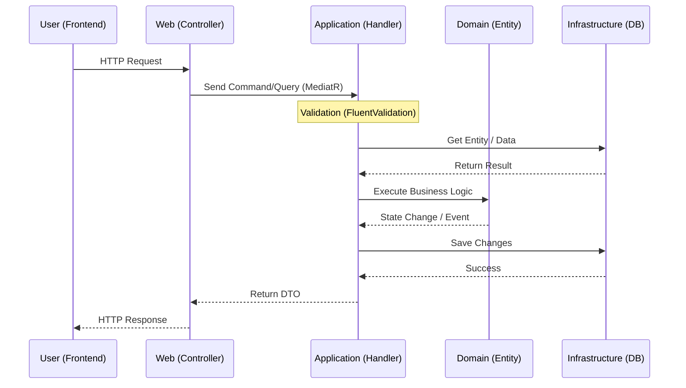

# 📂 TicketsPlease Source Directory

Willkommen im Herzstück der **TicketsPlease** Solution. Dieses Verzeichnis folgt strikt den Prinzipien der **Clean Architecture** (Onion Architecture) und des **Domain-Driven Design (DDD)**.

## 🏗️ Clean Architecture 101

Das Ziel dieser Architektur ist die **Trennung von Zuständigkeiten**. Die Geschäftslogik steht im Zentrum und ist völlig unabhängig von Infrastruktur (Datenbanken) und UI (Web).

### Der Request-Response Lifecycle

Jeder Request an das System folgt diesem standardisierten Pfad:

---

## 🛠️ Globale Code-Standards

Damit das Projekt auch für Anfänger wartbar bleibt, gelten folgende Regeln:

1.  **Keine Fragen offen**: Dokumentiere das "Warum", nicht das "Was".
2.  **`var` Keyword**: Nutze `var` nur, wenn der Typ auf der rechten Seite absolut offensichtlich ist (z.B. `var list = new List<string>()`). Bei komplexen Rückgabewerten schreibe den Typ explizit aus.
3.  **Dependency Injection**: Wir nutzen ausschließlich **Constructor Injection**. Keine `new`-Instanziierung von Klassen, die Geschäftslogik oder Infrastruktur enthalten.
4.  **Naming**: Interfaces starten immer mit `I`. Klassen sind Substantive. Methoden sind Verben im Imperativ.

---

## 🏗️ Layer & Zuständigkeiten

| Layer              | Farbe | Kurzbeschreibung                           | Dokumentation                                    |
| :----------------- | :---- | :----------------------------------------- | :----------------------------------------------- |
| **Domain**         | 🟢    | Enterprise Logic (Entities, Value Objects) | [README](TicketsPlease.Domain/README.md)         |
| **Application**    | 🟡    | Use Case Logic (CQRS, DTOs, Handlers)      | [README](TicketsPlease.Application/README.md)    |
| **Infrastructure** | 🔴    | Technical Logic (DB, Email, Storage)       | [README](TicketsPlease.Infrastructure/README.md) |
| **Web**            | 🔵    | Presentation Logic (UI, Controller, API)   | [README](TicketsPlease.Web/README.md)            |

---

## 🍴 Git Branching Strategy

| Layer              | Branch Name            | Fokus                           |
| :----------------- | :--------------------- | :------------------------------ |
| **Domain**         | `layer/domain`         | Core Logic, Entities, Events    |
| **Application**    | `layer/application`    | Use Cases, CQRS, DTOs           |
| **Infrastructure** | `layer/infrastructure` | Persistence, Identity, Services |
| **Web**            | `layer/web`            | UI/UX, Controllers, Assets      |

---

## 🛡️ Die unumstößliche Dependency Rule

Abhängigkeiten zeigen **immer nur nach innen** (Richtung Domain). Ein "Outer Layer" darf niemals direkt wissen, was in einem anderen "Outer Layer" passiert (z.B. Web darf nicht direkt auf Infrastructure zugreifen).

👉 **Weitere Informationen findest du in den jeweiligen READMEs der Sub-Verzeichnisse.**
