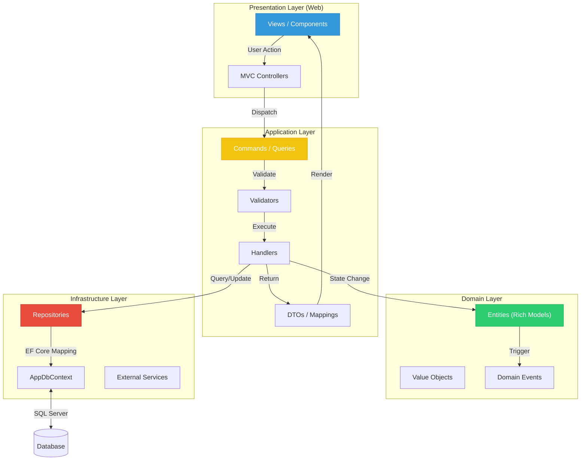

# 📂 TicketsPlease Source Directory

Willkommen im Herzstück der **TicketsPlease** Solution. Dieses Verzeichnis folgt
strikt den Prinzipien der **Clean Architecture** (Onion Architecture) und des
**Domain-Driven Design (DDD)**.

## 🏗️ Finale Vision: Das integrierte System

Dieser Graph zeigt, wie alle Teile der Solution ineinandergreifen, um einen
Request zu verarbeiten. Von der ersten Interaktion bis zur dauerhaften
Speicherung.

---

## 📊 Layer Metrics (Einstiegshilfe)

Hier siehst du, welcher Layer welche Herausforderungen birgt. Nutze dies als
Orientierung, wo du dich als Neuling am besten zuerst einarbeitest.

| Layer              | Schwierigkeit | Umfang    | Zeitaufwand | Typische Probleme                           |
| :----------------- | :-----------: | :-------- | :---------- | :------------------------------------------ |
| **Domain**         |     ⭐⭐      | Gering    | Hoch        | Zirkuläre Abhängigkeiten, Logik-Platzierung |
| **Application**    |    ⭐⭐⭐     | Hoch      | Mittel      | Validator-Logik vs. Handlers vs. Entities   |
| **Infrastructure** |   ⭐⭐⭐⭐    | Mittel    | Mittel      | EF Migrations, Concurrency, SQL-Performance |
| **Web**            |    ⭐⭐⭐     | Sehr Hoch | Hoch        | Tailwind-Ketten, JS-Security, View-Logik    |

---

## 🏗️ Layer & Zuständigkeiten

Hier siehst du auf einen Blick, welcher Layer für welche Aufgabe zuständig ist.
Klicke auf den Namen für die detaillierte Anleitung.

| Layer                                                        | Farbe | Kurzbeschreibung                           |                     Dokumentation                      |
| :----------------------------------------------------------- | :---: | :----------------------------------------- | :----------------------------------------------------: |
| [**Domain**](TicketsPlease.Domain/README.md)                 |  🟢   | Enterprise Logic (Entities, Value Objects) |     [Anleitung 📖](TicketsPlease.Domain/README.md)     |
| [**Application**](TicketsPlease.Application/README.md)       |  🟡   | Use Case Logic (CQRS, DTOs, Handlers)      |  [Anleitung 📖](TicketsPlease.Application/README.md)   |
| [**Infrastructure**](TicketsPlease.Infrastructure/README.md) |  🔴   | Technical Logic (DB, Email, Storage)       | [Anleitung 📖](TicketsPlease.Infrastructure/README.md) |
| [**Web**](TicketsPlease.Web/README.md)                       |  🔵   | Presentation Logic (UI, Controller, API)   |      [Anleitung 📖](TicketsPlease.Web/README.md)       |

---

## 📍 Startpunkte: "Ich möchte..."

Finde hier den direkten Einstiegspunkt für deine aktuelle Aufgabe:

| ...eine neue Eigenschaft hinzufügen                        | ...eine neue Geschäftsregel                                | ...etwas Speichern / Laden                                           |
| :--------------------------------------------------------- | :--------------------------------------------------------- | :------------------------------------------------------------------- |
| Gehe zu [Domain/Entities/](TicketsPlease.Domain/README.md) | Gehe zu [Domain/Entities/](TicketsPlease.Domain/README.md) | Gehe zu [Application/Features/](TicketsPlease.Application/README.md) |
| Füge Property mit `private set` hinzu                      | Implementiere eine Methode in der Entity                   | Erstelle Command/Query & Handler                                     |
| **Nächster Schritt:** EF Migration                         | **Nächster Schritt:** Unit Test                            | **Nächster Schritt:** Repository                                     |

---

👉 **Quick Links:** [Domain 🟢](TicketsPlease.Domain/README.md) |
[Application 🟡](TicketsPlease.Application/README.md)
[Infrastructure 🔴](TicketsPlease.Infrastructure/README.md) |
[Web 🔵](TicketsPlease.Web/README.md)
