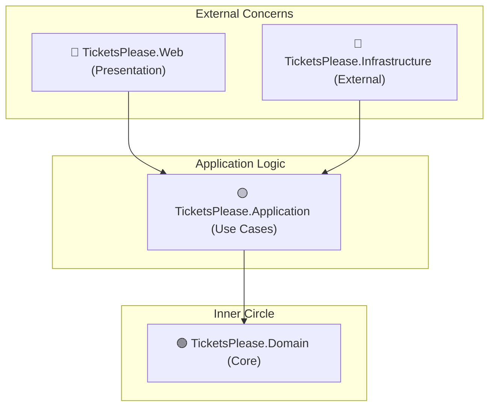

# 📂 TicketsPlease Source Directory

Willkommen im Herzstück der **TicketsPlease** Solution. Dieses Verzeichnis folgt strikt den Prinzipien der **Clean Architecture** (Onion Architecture) und des **Domain-Driven Design (DDD)**.

## 🏗️ Layer-Architektur & Zuständigkeiten

Jeder Mitarbeiter sollte sich primär in seinem zugewiesenen Layer bewegen und die Abhängigkeitsregeln respektieren.

### 1. 🟢 [TicketsPlease.Domain](TicketsPlease.Domain/README.md)
- **Kern:** Geschäftslogik, Entities, Value Objects.
- **Regel:** Absolut keine Abhängigkeiten nach außen.

### 2. 🟡 [TicketsPlease.Application](TicketsPlease.Application/README.md)
- **Orchestrierung:** Use Cases, CQRS (MediatR), Interfaces, DTOs.
- **Regel:** Enthält die Anwendungslogik, aber keine technischen Details.

### 3. 🔴 [TicketsPlease.Infrastructure](TicketsPlease.Infrastructure/README.md)
- **Technik:** Datenbank (EF Core), Mail, Caching, Identity.
- **Regel:** Implementiert die Interfaces der Application Layer.

### 4. 🔵 [TicketsPlease.Web](TicketsPlease.Web/README.md)
- **Präsentation:** Razor Views, Controller, TailwindCSS, Frontend-Assets.
- **Regel:** Dünne Controller, die alles an MediatR delegieren.

---

## 🍴 Git Branching Strategy

Um das parallele Arbeiten im Team zu optimieren, hat jeder Layer seinen eigenen dedizierten Entwicklungs-Branch. Feature-Entwicklungen finden primär auf diesen Branches statt, bevor sie in den `main` Branch gemerged werden.

| Layer | Branch Name | Fokus |
| :--- | :--- | :--- |
| **Domain** | `layer/domain` | Core Logic, Entities, Events |
| **Application** | `layer/application` | Use Cases, CQRS, DTOs |
| **Infrastructure** | `layer/infrastructure` | Persistence, Identity, Services |
| **Web** | `layer/web` | UI/UX, Controllers, Assets |

---

## 🛡️ Die unumstößliche Dependency Rule
Abhängigkeiten zeigen **immer nur nach innen** (Richtung Domain). Ein "Outer Layer" darf niemals direkt wissen, was in einem anderen "Outer Layer" passiert (z.B. Web darf nicht direkt auf Infrastructure zugreifen).

👉 **Weitere Informationen findest du in den jeweiligen READMEs der Sub-Verzeichnisse.**
