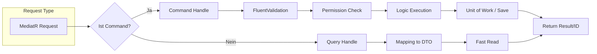

# 🟡 TicketsPlease.Application – Die Use Cases

Dieser Layer orchestriert die Geschäftsprozesse. Hier wird definiert, **was** die Anwendung tut.

## 🔄 Der CQS Flow (Command-Query-Segregation)

Wir trennen strikt zwischen Aktionen, die Daten ändern (Commands), und Aktionen, die Daten lesen
(Queries).



---

## 🏗️ Arbeitsanweisung: Wie finde ich meine Abhängigkeiten?

In diesem Layer darfst du **keine** `new`-Instanzen von Services erstellen. Nutze Dependency
Injection (DI) im Konstruktor.

### Woher kommen die Services?

1.  **Repositories**: Importiere `ITicketRepository` etc. aus `Contracts/`.
2.  **Infrastructure**: Wenn du Emails senden willst, nutze `IEmailService`.
3.  **Domain**: Die Entities werden direkt genutzt (sie haben keine DI).

**Handler-Vorlage:**

```csharp
public class MyHandler : IRequestHandler<MyRequest, MyResult> {
    private readonly IRepository _repo; // Bleib bei Interfaces!

    public MyHandler(IRepository repo) {
        _repo = repo;
    }
}
```

---

## 📋 Arbeitsanweisung: Use Case Blueprint

1.  **Slice erstellen**: Eine Datei in `Features/` (z.B. `AssignTicket.cs`).
2.  **Request Type**: Nutze `record` für Commands/Queries.
3.  **Validation**: Erstelle eine Klasse, die von `AbstractValidator<T>` erbt.
4.  **Handler**: Implementiere `IRequestHandler`. Halte ihn kurz (Logik in die Domain!).

---

## 📁 Struktur

- `Behaviors/`: Automatisches Logging, Validierung und Transaktionen.
- `Contracts/`: Schnittstellen für die Infrastructure.
- `Features/`: Die eigentliche Arbeit (nach Features sortiert).
- `Mappings/`: Konfiguration für Mapster (DTO-Konvertierung).

---

## 🔗 Connectors

- **Dependency Injection**: Alles wird in `DependencyInjection.cs` via Reflection registriert.
- **Web**: Sendet Commands via `ISender`.
- **Infrastructure**: Implementiert die hier definierten Interfaces.
