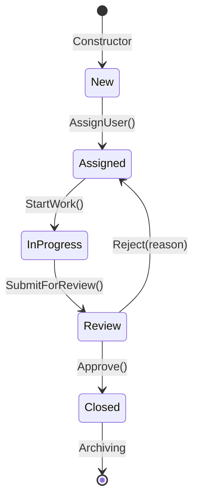

# 🟢 TicketsPlease.Domain – Der Core

Dies ist der wichtigste Layer der Anwendung. Hier leben die **Geschäftsregeln**
und die **Fachlichkeit**.

## 🧬 Lebenszyklus einer Entity (Beispiel Ticket)

Hier siehst du, wie sich der Zustand einer Entity verändern darf. Diese Regeln
müssen in den Methoden der Entity (nicht im Controller!) abgebildet werden.



---

## 🏗️ Domain-Driven Design (DDD) Grundlagen

### 1. Rich Domain Model vs. Anemic Domain Model

Wir nutzen **Rich Domain Models**. Die Entity verwaltet ihren eigenen Zustand.

**✅ RICHTIG (Rich):**

```csharp
public class Ticket {
    public string Status { get; private set; }

    public void Close(string reason) {
        if (string.IsNullOrEmpty(reason)) throw new DomainException("Reason required");
        Status = "Closed";
        AddDomainEvent(new TicketClosedEvent(this, reason));
    }
}
```

---

## 📋 Arbeitsanweisungen: Wie erstelle ich eine Entity?

1. **Klasse erstellen**: In `Entities/`.
2. **Abstraktion**: Erbe von `BaseEntity` (für ID, Auditing).
3. **Encapsulation**: Alle Properties haben `private set`.
4. **Validierung**: Prüfe Regeln direkt in den Methoden (Guard Clauses).
5. **Audit**: Denke an die Geo/IP Timestamps bei jeder Änderung!

---

## ⚠️ Noob-Falle: Zirkuläre Abhängigkeiten vermeiden

Ein häufiger Fehler ist der Versuch, Services aus anderen Layern (z.B.
Repository) in die Domain zu bringen.

- **Falle**: `ticket.SaveToDatabase()` -> **Verboten!**
- **Lösung**: Die Entity ändert nur ihren Zustand im Speicher. Das Speichern
  übernimmt der `Handler` in der Application Layer via Repository.

---

## 📁 Struktur

- `Entities/`: Kern-Objekte (z.B. `Ticket`, `Member`).
- `ValueObjects/`: Komplexe Typen ohne ID (z.B. `Priority`).
- `Events/`: Notifications (z.B. `TicketCreatedEvent`).
- `Exceptions/`: Fachliche Fehler (z.B. `OverdueTicketException`).

---

## 🔗 Connectors

- **Dependency Injection**: Nicht nötig. Entities werden mit `new` oder via EF
  Core erstellt.
- **Application**: Nutzt diese Entities für Use Cases.
