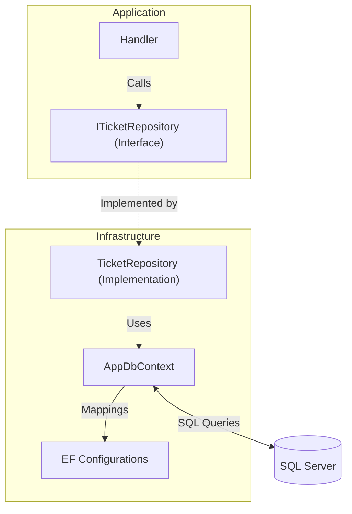

# 🔴 TicketsPlease.Infrastructure – Die Technik

Hier werden die technischen Details implementiert. Dieser Layer kümmert sich um
die Persistenz, externe APIs und systemnahe Dienste.

## 🗄️ Der Data Access Pattern

Wir nutzen das Repository Pattern in Kombination mit Entity Framework Core. Dies
erlaubt uns, den Datenzugriff testbar zu machen.



---

## 🛠️ Arbeitsanweisung: EF Core & Migrationen

1. **Entity erstellen**: In der `Domain` Layer.
2. **Configuration**: Erstelle eine Config-Klasse in
   `Persistence/Configurations/` (z.B. `TicketConfiguration.cs`), um
   Tabellennamen und Constraints zu definieren.
3. **Migration erstellen**:

   ```bash
   dotnet ef migrations add [Name] --project src/TicketsPlease.Infrastructure --startup-project src/TicketsPlease.Web
   ```

4. **Datenbank updaten**: Erfolgt automatisch beim Start der App (siehe
   `DbInitialiser`).

---

## 🚑 Troubleshooting: EF Core Fallen

### 1. N+1 Problem

Wenn du in einer Liste von Tickets auch die zugewiesenen User laden willst,
nutze immer `.Include()`:

- **❌ FALSCH**: `var tickets = _context.Tickets.ToList();` (Lädt User erst beim
  Zugriff -> 100 Abfragen für 100 Tickets).
- **✅ RICHTIG**:
  `var tickets = _context.Tickets.Include(t => t.AssignedUser).ToList();`

### 2. Tracked vs. No-Tracking

- Nutze `.AsNoTracking()` für reine Lese-Operationen (Queries) -> **Viel
  schneller!**
- Verzichte darauf bei Commands, wenn du die Entity danach speichern willst.

---

## 📁 Struktur

- `Persistence/`: Der gesamte Datenbank-Code (Context, Migrations, Configs).
- `Repositories/`: Implementierung der Contracts aus der Application Layer.
- `Identity/`: Anbindung an ASP.NET Core Identity.
- `Logging/`: Spezifische Logger-Implementierungen.

---

## 🔗 Connectors

- **Dependency Injection**: Hier musst du Services oft **manuell** in
  `DependencyInjection.cs` registrieren.
- **Application**: Erhält Implementierungen für ihre Interfaces.
