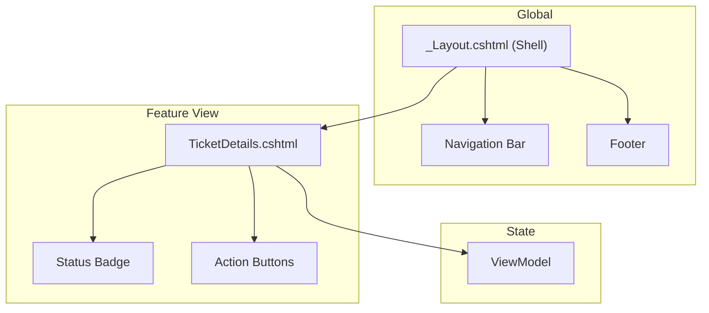

# 🔵 TicketsPlease.Web – Die Präsentation

Dieser Layer ist für die Interaktion mit dem Benutzer zuständig. Er umfasst das Web-Frontend, die
API-Endpunkte und das UI/UX-Design.

## 🎨 Frontend Komponenten-Komposition

Wir bauen unsere UI modular auf. Jedes Element ist eine Single File Component (SFC) oder eine klar
definierte Razor View.



---

## 💅 Styling SOP (Tailwind CSS 4.2.2)

Damit unsere UI "premium" bleibt, folgen wir diesen Styling-Regeln:

1. **Keine Utility-Wüsten**: Wenn eine Klasse mehr als 5 Utilities hat, abstrahiere sie in
   `css/components/` via `@apply`.
2. **Farben**: Nutze ausschließlich die vordefinierten CSS-Variablen aus dem Design System (z.B.
   `var(--brand-primary)`).
3. **Responsive**: Designe immer "Mobile First" (`sm:`, `md:`, `lg:`).
4. **Dark Mode**: Nutze das `dark:` Präfix für alle Oberflächen.
5. **i18n**: Nutze zwingend `@L["Key"]` via `IViewLocalizer`.
6. **BFSG**: Achte auf semantisches HTML und ARIA-Labels.

**Beispiel Komponente:**

```html
<button class="btn btn-primary" aria-label="@L["CreateTicket"]">
  <i class="fa-solid fa-plus" aria-hidden="true"></i>
  @L["NewTicket"]
</button>
```

---

## 📋 Arbeitsanweisung: Neuer Controller / View

1. **Dünner Controller**: In `Controllers/`. Er darf nur `_sender.Send()` aufrufen.
2. **ViewModel**: Erstelle ein spezifisches ViewModel für die View. Mappe das DTO aus der
   Application Layer darauf.
3. **Razor View**: Erstelle die `.cshtml` Datei. Achte auf semantisches HTML.
4. **Security**: Aktiviere Antiforgery-Tokens und nutze `DOMPurify` für dynamische Inhalte.

---

## 🌐 API & Dokumentation (Scalar)

Das Projekt stellt seine Schnittstellen modern über **.NET 10 nativer OpenAPI Generierung** zur
Verfügung. Auf veraltete Middleware wie Swagger wird verzichtet.

- **Endpoint**: `/scalar/v1`
- **Technologie**: Scalar v2 (`Scalar.AspNetCore`).
- **Design**: Premium "BluePlanet" Theme.
- **Rules**: Jeder Controller in `Controllers/Api/` muss mit `/// <summary>` XML-Tags annotiert
  sein. Diese werden automatisch in das UI übersetzt. Die Serialisierung erfolgt nativ mittels
  `System.Text.Json` (v10).

---

## 🎨 UI Styleguide (Living Documentation)

Wir pflegen einen interaktiven Styleguide, der alle verfügbaren Komponenten und Design-Tokens live
zeigt. Nutze diesen als Referenz für neue Views.

👉 **Zum Styleguide:** Öffne `/Styleguide` im Browser oder nutze den Link im Footer.

---

## 📁 Struktur

- `Controllers/`: Dünne Brücken zur Application Layer.
- `Controllers/Api/`: ReSTful API Endpunkte (via Scalar abgebildet).
- `Views/`: Razor-Templates (SFC-Style angestrebt).
- `Tailwind/`: Rohe CSS-Sources und Konfiguration (native Engine v4.2).
- `Tailwind/components/`: Abstrahierte UI-Styles (Cards, Buttons, Layout).
- `wwwroot/`: Statische Auslieferungs-Assets (kompiliertes CSS, JS, Images).

---

## 🔗 Connectors

- **MediatR**: Zentrale Schnittstelle zur Application Layer.
- **Tailwind MSBuild**: Automatische Kompilerung beim Speichern.
- **LibMan**: Paketmanager für Client-Side Libraries.
