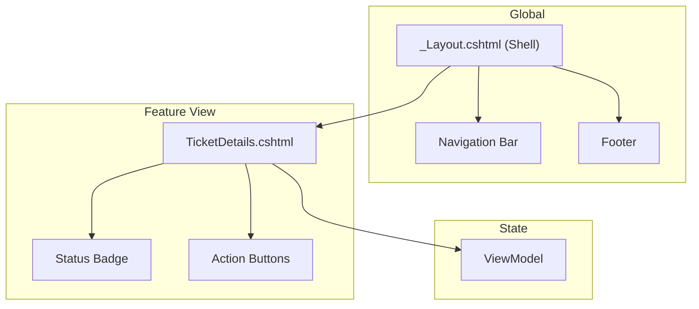

# 🔵 TicketsPlease.Web – Die Präsentation

Dieser Layer ist für die Interaktion mit dem Benutzer zuständig. Er umfasst das Web-Frontend,
die API-Endpunkte und das UI/UX-Design.

## 🎨 Frontend Komponenten-Komposition

Wir bauen unsere UI modular auf. Jedes Element ist eine Single File Component (SFC) oder eine
klar definierte Razor View.



---

## 💅 Styling SOP (Tailwind CSS 4.2)

Damit unsere UI "premium" bleibt, folgen wir diesen Styling-Regeln:

1. **Keine Utility-Wüsten**: Wenn eine Klasse mehr als 5 Utilities hat, abstrahiere
   sie in `css/components/` via `@apply`.
2. **Farben**: Nutze ausschließlich die vordefinierten CSS-Variablen aus dem Design System
   (z.B. `var(--brand-primary)`).
3. **Responsive**: Designe immer "Mobile First" (`sm:`, `md:`, `lg:`).
4. **Dark Mode**: Nutze das `dark:` Präfix für alle Oberflächen.

**Beispiel Komponente:**

```html
<div class="card-glass p-4 sm:p-6 transition-all hover:scale-[1.02]">
  <h3 class="text-brand-primary font-bold">Ticket #123</h3>
</div>
```

---

## 📋 Arbeitsanweisung: Neuer Controller / View

1. **Dünner Controller**: In `Controllers/`. Er darf nur `_sender.Send()` aufrufen.
2. **ViewModel**: Erstelle ein spezifisches ViewModel für die View. Mappe das DTO aus der
   Application Layer darauf.
3. **Razor View**: Erstelle die `.cshtml` Datei. Achte auf semantisches HTML.
4. **Security**: Aktiviere Antiforgery-Tokens und nutze `DOMPurify` für dynamische Inhalte.

---

## 📁 Struktur

- `Controllers/`: Dünne Brücken zur Application Layer.
- `Views/`: Razor-Templates (SFC-Style angestrebt).
- `css/components/`: Abstrahierte UI-Styles (Cards, Buttons, Layout).
- `wwwroot/`: Statische Assets (CSS, JS, Images).

---

## 🔗 Connectors

- **MediatR**: Zentrale Schnittstelle zur Application Layer.
- **Tailwind MSBuild**: Automatische Kompilerung beim Speichern.
- **LibMan**: Paketmanager für Client-Side Libraries.
